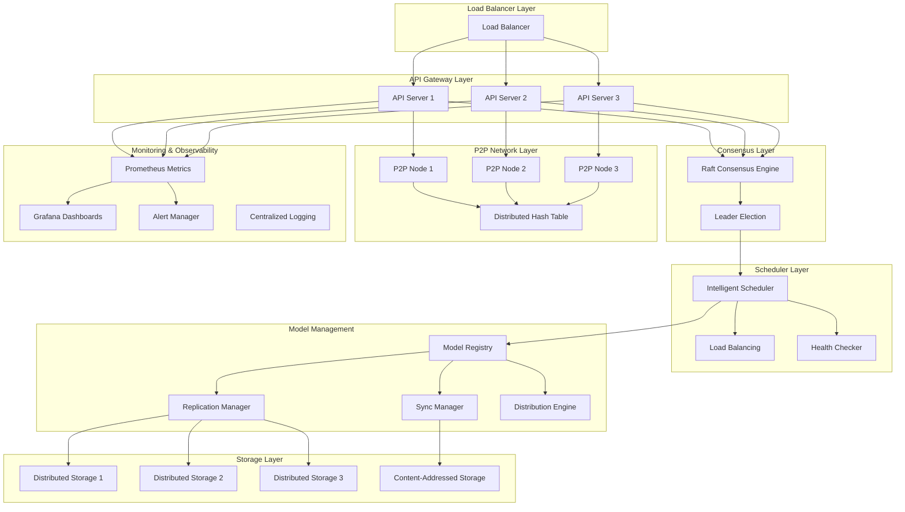

# OllamaMax: Enterprise-Grade Distributed AI Model Platform

[](https://golang.org)
[](LICENSE)
[](https://github.com/khryptorgraphics/ollamamax)
[](docs/production.md)

> **Enterprise-ready distributed AI model serving platform** that transforms single-node Ollama architecture into a horizontally scalable, fault-tolerant, high-performance distributed system.

## 🚀 Overview

OllamaMax is a comprehensive distributed AI model platform built for enterprise-scale deployments. It provides:

- **🌐 Distributed Architecture**: Horizontal scaling across multiple nodes with P2P networking
- **🔄 Consensus Engine**: Raft-based consensus for cluster coordination and consistency
- **⚡ Intelligent Scheduling**: Advanced load balancing and resource optimization
- **🎛️ Proxy Management CLI**: Comprehensive command-line tools for proxy monitoring and control
- **🛡️ Enterprise Security**: JWT authentication, TLS encryption, audit logging
- **📊 Comprehensive Monitoring**: Prometheus metrics, health checks, observability
- **🔧 Production Ready**: Kubernetes deployment, Helm charts, operational runbooks

## 🏗️ Architecture



### Core Components

| Component | Purpose | Technology |
|-----------|---------|------------|
| **API Server** | REST API gateway and web interface | Gin, WebSockets, JWT |
| **P2P Network** | Peer-to-peer networking and discovery | libp2p, DHT, PubSub |
| **Consensus Engine** | Cluster coordination and leader election | HashiCorp Raft |
| **Scheduler** | Intelligent request routing and load balancing | Custom algorithms |
| **Proxy Manager** | Load balancing and instance management | HTTP reverse proxy, CLI tools |
| **Model Manager** | Distributed model registry and replication | Content-addressed storage |
| **Security Layer** | Authentication, authorization, encryption | JWT, TLS, Audit logging |
| **Monitoring** | Metrics, health checks, observability | Prometheus, Grafana |

## 🚀 Quick Start

### Prerequisites

- **Go 1.24.5+**
- **Docker & Docker Compose** (for containerized deployment)
- **Kubernetes 1.25+** (for production deployment)
- **Helm 3.0+** (for Kubernetes package management)

### 1. Local Development Setup

```bash
# Clone repository
git clone https://github.com/khryptorgraphics/ollamamax.git
cd ollamamax/ollama-distributed

# Install dependencies
go mod download

# Build the binary
make build

# Run with default configuration
./bin/ollama-distributed start

# Monitor proxy status
./bin/ollama-distributed proxy status

# View cluster instances
./bin/ollama-distributed proxy instances

# Monitor metrics in real-time
./bin/ollama-distributed proxy metrics --watch
```

### 2. Docker Deployment

```bash
# Build Docker image
docker build -t ollamamax:latest .

# Run single node
docker run -p 11434:11434 -p 8080:8080 -p 9090:9090 ollamamax:latest

# Run cluster with Docker Compose
docker-compose up -d
```

### 3. Kubernetes Production Deployment

```bash
# Install with Helm
helm repo add ollamamax https://charts.ollamamax.com
helm install ollamamax ollamamax/ollamamax-cluster

# Or deploy with kubectl
kubectl apply -f k8s/
```

## 🎛️ CLI Reference

### Core Commands

```bash
# Start a distributed node
./ollama-distributed start [--config config.yaml] [--peers peer1,peer2]

# Check node status
./ollama-distributed status

# Join existing cluster
./ollama-distributed join --peers node1:8080,node2:8080
```

### Proxy Management

The proxy CLI provides comprehensive tools for managing the distributed Ollama proxy:

```bash
# Check proxy status
./ollama-distributed proxy status [--json] [--api-url URL]

# List registered instances
./ollama-distributed proxy instances [--json] [--api-url URL]

# Monitor performance metrics
./ollama-distributed proxy metrics [--json] [--api-url URL]

# Real-time metrics monitoring
./ollama-distributed proxy metrics --watch [--interval 5]
```

### Examples

```bash
# Start node and monitor proxy
./ollama-distributed start &
./ollama-distributed proxy status

# Monitor cluster health
./ollama-distributed proxy instances --json | jq '.instances[] | select(.status=="healthy")'

# Watch metrics in real-time
./ollama-distributed proxy metrics --watch --interval 10

# Check specific API endpoint
./ollama-distributed proxy status --api-url http://node2:8080
```

## 🔧 Configuration

### Environment-Specific Configurations

The system supports multiple environment configurations:

```bash
# Development
export OLLAMA_ENVIRONMENT=development
export OLLAMA_LOG_LEVEL=debug

# Staging  
export OLLAMA_ENVIRONMENT=staging
export OLLAMA_LOG_LEVEL=info

# Production
export OLLAMA_ENVIRONMENT=production
export OLLAMA_LOG_LEVEL=warn
export OLLAMA_TLS_ENABLED=true
export OLLAMA_AUTH_ENABLED=true
```

### Configuration Files

| Environment | Config File | Purpose |
|-------------|-------------|---------|
| Development | `config/dev.yaml` | Local development settings |
| Staging | `config/staging.yaml` | Pre-production testing |
| Production | `config/prod.yaml` | Production deployment |

### Key Configuration Sections

```yaml
# Example production configuration
node:
  environment: production
  region: us-west-2
  zone: us-west-2a

api:
  listen: "0.0.0.0:11434"
  tls:
    enabled: true
    cert_file: "/etc/tls/server.crt"
    key_file: "/etc/tls/server.key"

security:
  auth:
    enabled: true
    method: jwt
    token_expiry: 24h
  
metrics:
  enabled: true
  listen: "0.0.0.0:9090"
  
logging:
  level: info
  format: json
  output: stdout
```

## 📊 API Reference

### Core Endpoints

#### Cluster Management
```http
GET    /api/v1/cluster/status     # Cluster health and status
GET    /api/v1/cluster/leader     # Current cluster leader
POST   /api/v1/cluster/join       # Join existing cluster
POST   /api/v1/cluster/leave      # Leave cluster gracefully
```

#### Node Management  
```http
GET    /api/v1/nodes              # List all cluster nodes
GET    /api/v1/nodes/{id}         # Get specific node details
POST   /api/v1/nodes/{id}/drain   # Drain node for maintenance
POST   /api/v1/nodes/{id}/undrain # Return node to service
```

#### Model Operations
```http
GET    /api/v1/models             # List available models
GET    /api/v1/models/{name}      # Get model details
POST   /api/v1/models/{name}/download  # Download model to cluster
DELETE /api/v1/models/{name}      # Remove model from cluster
```

#### AI Inference
```http
POST   /api/v1/generate           # Text generation
POST   /api/v1/chat               # Chat completion
POST   /api/v1/embeddings         # Text embeddings
```

#### Monitoring & Health
```http
GET    /api/v1/health             # System health check
GET    /api/v1/metrics            # Prometheus metrics
GET    /api/v1/transfers          # Model transfer status
GET    /api/v1/ws                 # WebSocket endpoint
```

### Authentication

All API endpoints require JWT authentication:

```bash
# Obtain JWT token
curl -X POST http://localhost:11434/auth/login \
  -H "Content-Type: application/json" \
  -d '{"username":"admin","password":"secret"}'

# Use token in requests
curl -H "Authorization: Bearer <jwt-token>" \
  http://localhost:11434/api/v1/cluster/status
```

## 🚢 Production Deployment

### Kubernetes Deployment

#### 1. Install with Helm (Recommended)

```bash
# Add Helm repository
helm repo add ollamamax https://charts.ollamamax.com
helm repo update

# Install with production values
helm install ollamamax ollamamax/ollamamax-cluster \
  --namespace ollamamax \
  --create-namespace \
  --values values-production.yaml
```

#### 2. Manual Kubernetes Deployment

```bash
# Create namespace
kubectl create namespace ollamamax

# Deploy core components
kubectl apply -f k8s/configmap.yaml
kubectl apply -f k8s/secret.yaml
kubectl apply -f k8s/service.yaml
kubectl apply -f k8s/deployment.yaml
kubectl apply -f k8s/ingress.yaml

# Deploy monitoring stack
kubectl apply -f k8s/monitoring/
```

### Production Checklist

- [ ] **Security**: TLS certificates configured and valid
- [ ] **Authentication**: JWT secrets rotated and secure
- [ ] **Monitoring**: Prometheus metrics collection enabled
- [ ] **Alerting**: Alert rules configured for critical metrics
- [ ] **Backup**: Automated backup procedures in place
- [ ] **Logging**: Centralized log aggregation configured
- [ ] **Network**: Firewall rules and network policies applied
- [ ] **Storage**: Persistent volumes configured for data
- [ ] **Scaling**: Horizontal Pod Autoscaler configured
- [ ] **Health Checks**: Liveness and readiness probes configured

## 📈 Monitoring & Observability

### Prometheus Metrics

Key metrics exposed for monitoring:

```
# Node Metrics
ollama_nodes_total                    # Total nodes in cluster
ollama_nodes_online                   # Online nodes count
ollama_nodes_offline                  # Offline nodes count

# Model Metrics  
ollama_models_total                   # Total models in registry
ollama_models_loaded                  # Currently loaded models
ollama_model_replicas                 # Model replication factor

# Request Metrics
ollama_requests_total                 # Total API requests
ollama_requests_duration_seconds      # Request duration histogram
ollama_requests_errors_total          # Request error count

# System Metrics
ollama_cpu_usage_percent              # CPU utilization
ollama_memory_usage_bytes             # Memory usage
ollama_network_bytes_total            # Network I/O
ollama_disk_usage_bytes               # Disk utilization

# P2P Metrics
ollama_peers_connected                # Connected peers
ollama_peer_connections_total         # Total P2P connections
ollama_peer_messages_total            # P2P message count

# Consensus Metrics
ollama_consensus_leader_changes       # Leadership changes
ollama_consensus_log_entries          # Raft log entries
ollama_consensus_applied_entries      # Applied log entries
```

### Grafana Dashboards

Pre-built dashboards available in `monitoring/grafana/`:

- **Cluster Overview**: High-level cluster health and status
- **Node Performance**: Individual node metrics and resources
- **Model Management**: Model distribution and replication status
- **API Performance**: Request rates, latency, and error rates
- **P2P Network**: Peer connectivity and network health
- **Consensus Health**: Raft consensus and leadership metrics

### Alert Rules

Critical alerts configured in `monitoring/alerts/`:

- **Node Down**: Node becomes unreachable
- **High CPU Usage**: CPU utilization > 80%
- **Memory Pressure**: Memory usage > 85%
- **Disk Full**: Disk usage > 90%
- **API Errors**: Error rate > 5%
- **Consensus Split**: Leadership instability
- **Model Replication**: Under-replicated models

## 🔒 Security

### Production Security Features

| Feature | Implementation | Status |
|---------|----------------|--------|
| **TLS Encryption** | TLS 1.3 with strong cipher suites | ✅ Enabled |
| **JWT Authentication** | HMAC-256 signed tokens | ✅ Enabled |
| **RBAC Authorization** | Role-based access control | ✅ Enabled |
| **Audit Logging** | Comprehensive audit trail | ✅ Enabled |
| **Network Security** | Firewall rules and network policies | ✅ Enabled |
| **Secret Management** | Kubernetes secrets integration | ✅ Enabled |
| **Certificate Rotation** | Automated certificate management | ✅ Enabled |

### Security Configuration

```yaml
security:
  tls:
    enabled: true
    min_version: "1.3"
    cert_file: "/etc/tls/server.crt"
    key_file: "/etc/tls/server.key"
    ca_file: "/etc/tls/ca.crt"
  
  auth:
    enabled: true
    method: jwt
    token_expiry: 24h
    secret_key: "${JWT_SECRET}"
  
  audit:
    enabled: true
    log_file: "/var/log/ollama/audit.log"
    format: json
  
  firewall:
    enabled: true
    allowed_ips:
      - "10.0.0.0/8"
      - "172.16.0.0/12"
      - "192.168.0.0/16"
```

## 🛠️ Operations & Maintenance

### Operational Procedures

#### Cluster Operations

```bash
# Check cluster health
ollama-distributed status

# Add new node to cluster
ollama-distributed join --peers=node1:4001,node2:4001

# Drain node for maintenance
kubectl drain ollama-node-1 --delete-local-data --ignore-daemonsets

# Scale cluster horizontally
kubectl scale deployment ollama-cluster --replicas=5
```

#### Model Management

```bash
# Download model to cluster
curl -X POST http://localhost:11434/api/v1/models/llama2:7b/download

# Check model distribution
curl http://localhost:11434/api/v1/models/llama2:7b

# Enable auto-distribution
curl -X POST http://localhost:11434/api/v1/distribution/auto-configure \
  -H "Content-Type: application/json" \
  -d '{"enabled": true}'
```

#### Backup & Recovery

```bash
# Backup cluster state
kubectl exec -it ollama-leader -- \
  ollama-distributed backup --output=/backup/cluster-state.tar.gz

# Restore from backup
kubectl exec -it ollama-leader -- \
  ollama-distributed restore --input=/backup/cluster-state.tar.gz
```

### Troubleshooting

#### Common Issues

| Issue | Symptoms | Solution |
|-------|----------|----------|
| **Split Brain** | Multiple leaders elected | Check network connectivity, restart nodes |
| **High Latency** | Slow API responses | Check node resources, scale cluster |
| **Model Load Failure** | Models not downloading | Check storage capacity, network connectivity |
| **Authentication Errors** | 401 responses | Verify JWT tokens, check secret configuration |
| **Memory Issues** | Out of memory errors | Increase node memory, optimize model allocation |

#### Debug Commands

```bash
# View cluster logs
kubectl logs -f deployment/ollama-cluster

# Check P2P network status
ollama-distributed p2p-status

# Validate configuration
ollama-distributed config-validate

# Run health diagnostics
ollama-distributed diagnose --full
```

### Performance Tuning

#### Resource Optimization

```yaml
# Kubernetes resource configuration
resources:
  requests:
    cpu: "2"
    memory: "4Gi"
  limits:
    cpu: "4" 
    memory: "8Gi"

# JVM tuning for Go runtime
env:
  - name: GOGC
    value: "100"
  - name: GOMAXPROCS
    value: "4"
```

#### Scaling Guidelines

| Metric | Scale Up Trigger | Scale Down Trigger |
|--------|------------------|-------------------|
| **CPU Usage** | > 70% for 5 minutes | < 30% for 10 minutes |
| **Memory Usage** | > 80% for 3 minutes | < 40% for 15 minutes |
| **Request Queue** | > 100 pending | < 10 pending |
| **Response Time** | > 500ms average | < 100ms average |

## 🤝 Contributing

We welcome contributions! Please see our [Contributing Guide](CONTRIBUTING.md) for details.

### Development Workflow

```bash
# Set up development environment
make dev-setup

# Run tests
make test

# Run integration tests
make test-integration

# Build and test locally
make build-local

# Submit pull request
git checkout -b feature/your-feature
git commit -am "Add your feature"
git push origin feature/your-feature
```

### Code Quality Standards

- **Test Coverage**: Minimum 80% code coverage required
- **Code Style**: Use `gofmt` and `golint` for consistent formatting
- **Documentation**: All public APIs must be documented
- **Security**: Security review required for auth/crypto changes

## 📚 Documentation

### Quick References
- **[CLI Reference](ollama-distributed/CLI_REFERENCE.md)** - Complete command-line guide
- **[Proxy CLI Implementation](ollama-distributed/PROXY_CLI_IMPLEMENTATION.md)** - Technical implementation details

### Comprehensive Guides
- **[Architecture Overview](docs/architecture.md)** - System design and components
- **[API Reference](docs/api.md)** - REST API documentation
- **[Configuration Guide](docs/configuration.md)** - Setup and configuration
- **[Deployment Guide](docs/deployment.md)** - Production deployment
- **[Security Guide](docs/security.md)** - Security best practices
- **[Monitoring Guide](docs/monitoring.md)** - Observability and metrics
- **[Troubleshooting](docs/troubleshooting.md)** - Common issues and solutions

## 📞 Support

### Community Support

- **GitHub Issues**: [Report bugs and request features](https://github.com/khryptorgraphics/ollamamax/issues)
- **Discussions**: [Community discussions and Q&A](https://github.com/khryptorgraphics/ollamamax/discussions)
- **Documentation**: [Comprehensive documentation](https://docs.ollamamax.com)

### Enterprise Support

For enterprise support, consulting, and professional services:

- **Email**: enterprise@ollamamax.com
- **Support Portal**: https://support.ollamamax.com
- **Phone**: +1-800-OLLAMA-X

## 📄 License

This project is licensed under the MIT License - see the [LICENSE](LICENSE) file for details.

## 🙏 Acknowledgments

- **Ollama Team**: For the original single-node implementation
- **HashiCorp**: For the excellent Raft consensus library
- **libp2p Team**: For robust P2P networking primitives
- **Prometheus & Grafana**: For comprehensive monitoring solutions
- **Kubernetes Community**: For container orchestration platform

---

**Built with ❤️ for the AI community** | [Website](https://ollamamax.com) | [Documentation](https://docs.ollamamax.com) | [Community](https://community.ollamamax.com)