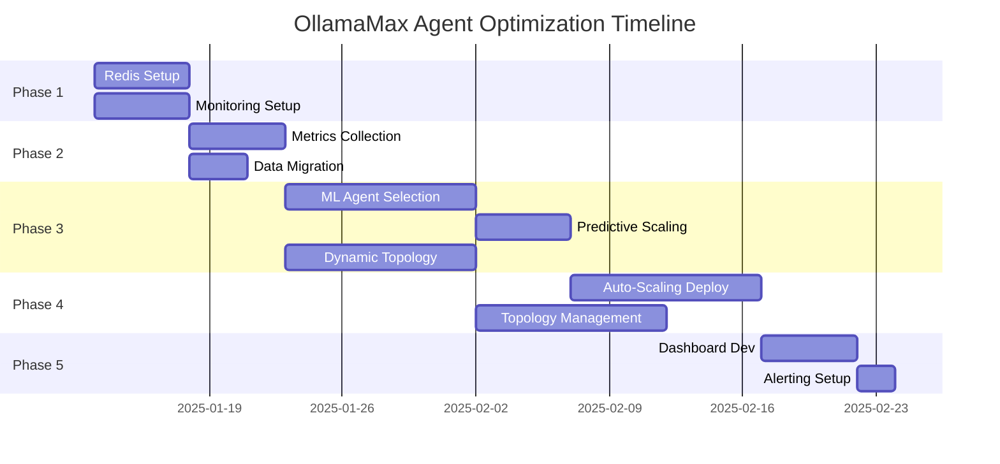

# OllamaMax Agent System Optimization Workflow

## Executive Summary
Systematic implementation workflow for enhancing the OllamaMax agent capabilities system with predictive scaling, intelligent selection, and distributed caching.

**Timeline**: 7 weeks (with parallel execution)  
**Team Size**: 3-4 developers  
**Priority**: High-impact optimizations for performance and reliability

---

## Phase 1: Infrastructure Foundation (Week 1)

### 1.1 Redis Distributed Cache Setup
**Owner**: Backend Developer  
**Dependencies**: None (can start immediately)

#### Tasks
```bash
# A. Redis Cluster Configuration
- [ ] Install Redis cluster (6 nodes minimum)
- [ ] Configure master-slave replication
- [ ] Setup Redis Sentinel for HA
- [ ] Implement connection pooling

# B. Cache Client Integration
- [ ] Create Redis client wrapper in src/cache/redis-client.js
- [ ] Implement cache patterns (write-through, write-behind)
- [ ] Add TTL management for different data types
- [ ] Create cache invalidation strategies

# C. Testing & Validation
- [ ] Connection resilience testing
- [ ] Performance benchmarking (target: <5ms read latency)
- [ ] Failover scenario testing
```

#### Implementation Code Structure
```javascript
// src/cache/redis-client.js
class RedisCache {
  constructor(config) {
    this.cluster = new Redis.Cluster(config.nodes);
    this.ttlConfig = {
      agentMetrics: 3600,      // 1 hour
      taskHistory: 86400,      // 24 hours
      swarmState: 300          // 5 minutes
    };
  }
}
```

### 1.2 Monitoring Infrastructure
**Owner**: DevOps Engineer  
**Dependencies**: None (parallel with 1.1)

#### Tasks
```bash
# A. Metrics Collection Setup
- [ ] Deploy Prometheus for metrics collection
- [ ] Configure Grafana for visualization
- [ ] Setup OpenTelemetry instrumentation
- [ ] Create custom metrics exporters

# B. Agent-Specific Metrics
- [ ] Task completion rates per agent
- [ ] Execution time distributions
- [ ] Resource usage patterns
- [ ] Error rates and types
```

---

## Phase 2: Data Collection Layer (Week 2)

### 2.1 Performance Metrics Collection
**Owner**: Backend Developer  
**Dependencies**: Phase 1.1 (Redis)

#### Tasks
```bash
# A. Metrics Schema Design
- [ ] Define agent performance metrics structure
- [ ] Create task execution history schema
- [ ] Design swarm coordination metrics

# B. Collection Implementation
- [ ] Instrument agent-registry.js with metrics
- [ ] Add performance hooks to Task execution
- [ ] Implement batch metric writes to Redis
- [ ] Create metric aggregation pipelines
```

#### Metrics Schema
```javascript
{
  agentId: "coder-001",
  taskId: "task-123",
  metrics: {
    executionTime: 1250,      // ms
    cpuUsage: 45,            // %
    memoryUsage: 128,        // MB
    successRate: 0.95,
    errorCount: 2,
    timestamp: 1736550000000
  }
}
```

### 2.2 Historical Data Migration
**Owner**: Data Engineer  
**Dependencies**: Phase 1.1

#### Tasks
```bash
# A. Data Migration
- [ ] Export existing JSON memory stores
- [ ] Transform to Redis-compatible format
- [ ] Batch import to Redis cluster
- [ ] Verify data integrity
```

---

## Phase 3: Intelligence Layer (Weeks 3-4)

### 3.1 ML-Based Agent Selection
**Owner**: ML Engineer  
**Dependencies**: Phase 2.1

#### Tasks
```bash
# A. Model Development
- [ ] Feature engineering from historical metrics
- [ ] Train agent selection model (Random Forest)
- [ ] Implement online learning capabilities
- [ ] Create model versioning system

# B. Integration
- [ ] Create ML prediction service
- [ ] Integrate with agent-registry.js
- [ ] Add fallback to capability-based selection
- [ ] Implement A/B testing framework
```

#### ML Pipeline
```javascript
// src/ml/agent-selector.js
class MLAgentSelector {
  async selectAgent(task, context) {
    const features = await this.extractFeatures(task, context);
    const predictions = await this.model.predict(features);
    return this.rankAgents(predictions);
  }
}
```

### 3.2 Predictive Auto-Scaling
**Owner**: Backend Developer  
**Dependencies**: Phase 3.1

#### Tasks
```bash
# A. Prediction Models
- [ ] Time-series forecasting for load prediction
- [ ] Pattern recognition for task clustering
- [ ] Anomaly detection for spike prediction

# B. Scaling Logic
- [ ] Implement predictive scaling algorithms
- [ ] Create scale-up/down decision engine
- [ ] Add cooldown and dampening logic
- [ ] Integrate with swarm-enhanced.js
```

### 3.3 Dynamic Topology Optimization
**Owner**: Systems Architect  
**Dependencies**: Phase 2.1 (parallel with 3.1, 3.2)

#### Tasks
```bash
# A. Topology Analysis
- [ ] Performance profiling per topology
- [ ] Workload classification system
- [ ] Topology switching criteria

# B. Implementation
- [ ] Dynamic topology switcher
- [ ] Graceful transition mechanisms
- [ ] State preservation during switch
```

---

## Phase 4: Dynamic Systems Integration (Weeks 5-6)

### 4.1 Auto-Scaling System Deployment
**Owner**: Backend Developer  
**Dependencies**: Phase 3.2

#### Tasks
```bash
# A. System Integration
- [ ] Connect predictive models to scaling engine
- [ ] Implement agent lifecycle management
- [ ] Add resource limit enforcement
- [ ] Create scaling event logging

# B. Testing
- [ ] Load testing with various patterns
- [ ] Chaos engineering scenarios
- [ ] Performance regression testing
```

#### Auto-Scaling Configuration
```javascript
// Enhanced configuration in swarm-enhanced.js
scalingConfig: {
  mode: 'predictive',
  prediction: {
    model: 'timeseries-lstm',
    horizon: 300000,          // 5 minute lookahead
    confidence: 0.85
  },
  thresholds: {
    scaleUp: 0.75,
    scaleDown: 0.25,
    emergency: 0.95
  },
  limits: {
    max: 50,                  // Increased from 25
    min: 5,
    rateLimit: 10             // Max scaling rate per minute
  }
}
```

### 4.2 Topology Management System
**Owner**: Systems Architect  
**Dependencies**: Phase 3.3

#### Tasks
```bash
# A. Topology Controller
- [ ] Real-time topology switching
- [ ] Agent migration during switches
- [ ] Performance validation post-switch

# B. Optimization Rules
- [ ] Rule engine for topology selection
- [ ] Performance-based rules
- [ ] Cost-based optimization
```

---

## Phase 5: Visualization & Monitoring (Week 7)

### 5.1 Real-Time Dashboard Development
**Owner**: Frontend Developer  
**Dependencies**: Phases 1-4

#### Tasks
```bash
# A. Dashboard Components
- [ ] Agent status grid view
- [ ] Performance metrics charts
- [ ] Topology visualization
- [ ] Scaling event timeline
- [ ] Task queue monitoring

# B. Real-Time Updates
- [ ] WebSocket connection for live data
- [ ] Redis pub/sub integration
- [ ] Alert notification system
```

#### Dashboard Features
```javascript
// Dashboard configuration
{
  panels: [
    { type: 'agent-grid', refresh: 1000 },
    { type: 'performance-chart', window: '1h' },
    { type: 'topology-graph', interactive: true },
    { type: 'scaling-timeline', range: '24h' },
    { type: 'alert-feed', priority: 'high' }
  ]
}
```

### 5.2 Alerting & Reporting
**Owner**: DevOps Engineer  
**Dependencies**: Phase 5.1

#### Tasks
```bash
# A. Alert Configuration
- [ ] Performance degradation alerts
- [ ] Scaling failure notifications
- [ ] Resource exhaustion warnings

# B. Reporting
- [ ] Daily performance reports
- [ ] Weekly optimization insights
- [ ] Monthly cost analysis
```

---

## Parallel Execution Plan



---

## Testing & Validation Strategy

### Unit Testing
```bash
npm test -- --coverage --testPathPattern="optimization"
```

### Integration Testing
```bash
# Test Redis integration
npm run test:redis

# Test ML models
npm run test:ml

# Test auto-scaling
npm run test:scaling
```

### Performance Testing
```bash
# Load testing
npx artillery run tests/load/agent-scaling.yml

# Chaos testing
npx claude-flow chaos --scenario agent-failure
```

---

## Risk Mitigation

| Risk | Impact | Mitigation |
|------|--------|------------|
| Redis cluster failure | High | Multi-region replication, automatic failover |
| ML model accuracy | Medium | A/B testing, fallback to rule-based |
| Scaling oscillation | Medium | Dampening algorithms, cooldown periods |
| Memory exhaustion | High | Resource limits, circuit breakers |

---

## Success Metrics

### Performance Targets
- **Agent Selection**: <50ms decision time
- **Auto-Scaling**: <30s response to load changes
- **Cache Hit Rate**: >85% for hot data
- **Dashboard Latency**: <100ms update time

### Business Metrics
- **Cost Reduction**: 30% through efficient scaling
- **Reliability**: 99.9% uptime
- **Performance**: 2x throughput improvement
- **Developer Productivity**: 40% reduction in manual interventions

---

## Implementation Commands

### Quick Start
```bash
# Initialize optimization branch
git checkout -b feature/agent-optimizations

# Install dependencies
npm install redis ioredis @tensorflow/tfjs prometheus-client

# Setup development environment
cp .env.example .env.optimization
./scripts/setup-redis-dev.sh

# Run optimization tests
npm run test:optimizations
```

### Deployment
```bash
# Deploy Phase 1
kubectl apply -f k8s/redis-cluster.yaml
kubectl apply -f k8s/monitoring.yaml

# Deploy ML models
./scripts/deploy-ml-models.sh

# Enable predictive scaling
npx claude-flow config set scaling.mode predictive
```

---

## Documentation & Training

### Developer Documentation
- [ ] Redis integration guide
- [ ] ML model training pipeline
- [ ] Dashboard customization guide
- [ ] Troubleshooting handbook

### Team Training
- [ ] Redis cluster management
- [ ] ML model maintenance
- [ ] Performance tuning workshop
- [ ] Incident response procedures

---

## Post-Implementation Review

### Week 8: Review & Optimization
- Performance analysis against targets
- Cost-benefit analysis
- Team retrospective
- Documentation updates
- Knowledge transfer sessions

### Continuous Improvement
- Monthly performance reviews
- Quarterly model retraining
- Bi-annual architecture review
- Ongoing optimization iterations

---

## Appendix: Configuration Files

### Redis Configuration
```yaml
# redis-cluster.yaml
cluster:
  nodes: 6
  replicas: 1
  maxmemory: 4gb
  maxmemory-policy: allkeys-lru
  persistence:
    enabled: true
    schedule: "0 */6 * * *"
```

### ML Model Configuration
```json
{
  "agentSelection": {
    "model": "random-forest",
    "features": ["taskType", "complexity", "historicalPerformance"],
    "training": {
      "schedule": "0 2 * * *",
      "minSamples": 1000
    }
  }
}
```

### Monitoring Configuration
```yaml
# prometheus.yaml
scrape_configs:
  - job_name: 'ollamamax-agents'
    scrape_interval: 15s
    static_configs:
      - targets: ['localhost:9090']
    metrics_path: /metrics
```

---

*This workflow document serves as the implementation blueprint for the OllamaMax agent system optimizations. Regular updates and adjustments should be made based on implementation learnings and changing requirements.*