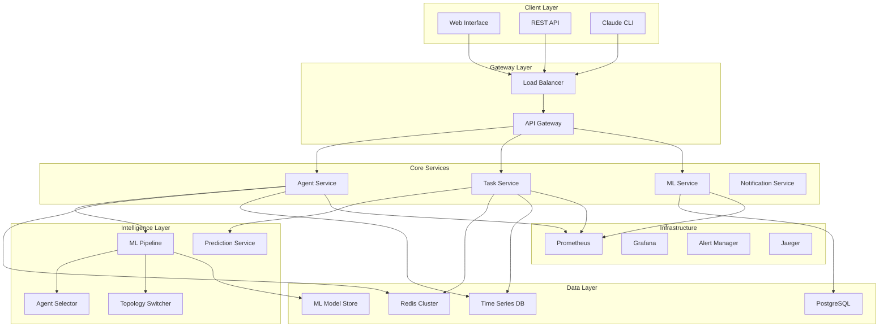

# Enhanced OllamaMax Agent System - Architecture Design & Sprint Plan

## System Architecture Overview

### Current State Analysis
- **Go Backend**: PostgreSQL + Redis distributed system
- **Node.js API**: Authentication, user management, web interface
- **Agent Registry**: 54 specialized + 100+ expert agents
- **Infrastructure**: Docker Compose with service mesh architecture

### Target Architecture: Intelligent Agent Orchestration System



---

## 🚀 Unified Sprint Plan (8 Weeks)

### Sprint 1: Foundation Infrastructure (Week 1-2)

#### Sprint Goal
Establish distributed cache, monitoring, and data collection infrastructure

#### User Stories
```
US-1.1: As a system admin, I need Redis cluster for high-performance agent metrics
US-1.2: As a developer, I need monitoring infrastructure for system observability
US-1.3: As a system architect, I need data collection for agent performance analysis
```

#### Technical Tasks

**Sprint 1.1 - Infrastructure Setup (Week 1)**
- [ ] **Redis Cluster Architecture**
  ```yaml
  # Redis Cluster Design
  topology:
    nodes: 6 (3 masters, 3 replicas)
    sharding: hash-slot based
    persistence: RDB + AOF
    memory: 4GB per node
    network: private subnet
  
  performance_targets:
    read_latency: <2ms p99
    write_latency: <5ms p99
    throughput: 100k ops/sec
    availability: 99.9%
  ```

- [ ] **Monitoring Stack Architecture**
  ```yaml
  # Observability Design
  components:
    metrics: Prometheus + Grafana
    logging: ELK Stack
    tracing: Jaeger
    alerting: AlertManager
  
  data_retention:
    metrics: 30 days
    logs: 7 days
    traces: 3 days
  ```

**Sprint 1.2 - Data Collection Layer (Week 2)**
- [ ] **Agent Metrics Schema Design**
  ```javascript
  // Agent Performance Schema
  {
    agentId: "coder-001",
    timestamp: 1736550000000,
    metrics: {
      execution: {
        taskId: "task-123",
        duration: 1250,      // ms
        success: true,
        errorType: null
      },
      resources: {
        cpu: 45,            // %
        memory: 128,        // MB
        concurrent: 3       // active tasks
      },
      quality: {
        successRate: 0.95,
        errorRate: 0.05,
        retryCount: 1
      }
    }
  }
  ```

- [ ] **Time Series Database Setup**
  - InfluxDB for agent performance metrics
  - Retention policies for different data types
  - Data aggregation rules

#### Sprint 1 Deliverables
✅ Redis cluster operational (6 nodes)  
✅ Prometheus/Grafana monitoring active  
✅ Agent metrics collection pipeline  
✅ Basic performance dashboard  
✅ Data retention and backup strategies

#### Definition of Done
- [ ] Redis cluster passes load tests (100k ops/sec)
- [ ] All services have health checks and metrics
- [ ] Data collection captures agent performance
- [ ] Grafana dashboard shows real-time metrics
- [ ] Automated backup and recovery tested

---

### Sprint 2: Machine Learning Pipeline (Week 3-4)

#### Sprint Goal
Implement ML-based agent selection and predictive capabilities

#### User Stories
```
US-2.1: As a system, I need intelligent agent selection based on performance history
US-2.2: As an operator, I need predictive insights for system scaling decisions
US-2.3: As a developer, I need A/B testing for ML model improvements
```

#### Technical Tasks

**Sprint 2.1 - ML Infrastructure (Week 3)**
- [ ] **ML Pipeline Architecture**
  ```python
  # ML Service Architecture
  class MLPipeline:
      components:
          - feature_store: Redis-based feature storage
          - model_registry: Versioned model storage
          - training_service: Batch training pipeline
          - inference_service: Real-time predictions
          - evaluation_service: Model performance monitoring
  ```

- [ ] **Agent Selection Model**
  ```python
  # Random Forest Model for Agent Selection
  features = [
      'agent_type',           # categorical
      'task_complexity',      # numerical 
      'historical_success',   # numerical
      'current_load',         # numerical
      'avg_execution_time',   # numerical
      'error_rate_24h',      # numerical
      'resource_utilization'  # numerical
  ]
  
  model = RandomForestClassifier(
      n_estimators=100,
      max_depth=10,
      class_weight='balanced'
  )
  ```

**Sprint 2.2 - Predictive Scaling (Week 4)**
- [ ] **LSTM Time Series Model**
  ```python
  # Load Prediction Model
  model_architecture = {
      'layers': [
          LSTM(50, return_sequences=True),
          Dropout(0.2),
          LSTM(50),
          Dropout(0.2),
          Dense(1, activation='sigmoid')
      ],
      'lookback': 60,     # 1 hour of 1-minute intervals
      'forecast': 15,     # 15 minutes ahead
      'features': ['task_queue', 'agent_utilization', 'error_rate']
  }
  ```

- [ ] **A/B Testing Framework**
  ```javascript
  // A/B Testing Configuration
  const abTests = {
    agentSelection: {
      control: 'capability-based',
      treatment: 'ml-based',
      allocation: 0.5,        // 50/50 split
      metrics: ['task_success', 'execution_time'],
      duration: 14            // days
    }
  };
  ```

#### Sprint 2 Deliverables
✅ ML training pipeline operational  
✅ Agent selection model (85%+ accuracy)  
✅ Predictive scaling model deployed  
✅ A/B testing framework active  
✅ Model performance monitoring

---

### Sprint 3: Auto-Scaling & Dynamic Systems (Week 5-6)

#### Sprint Goal
Deploy intelligent auto-scaling with dynamic topology management

#### User Stories
```
US-3.1: As a system, I need predictive auto-scaling to handle load variations
US-3.2: As an operator, I need dynamic topology switching for optimization
US-3.3: As a user, I need consistent performance during scaling events
```

#### Technical Tasks

**Sprint 3.1 - Auto-Scaling Engine (Week 5)**
- [ ] **Predictive Scaling Architecture**
  ```javascript
  // Enhanced Auto-Scaling Configuration
  class PredictiveScaler {
    config = {
      prediction: {
        model: 'lstm-timeseries',
        horizon: 900000,        // 15 minutes
        confidence: 0.85,
        updateInterval: 60000   // 1 minute
      },
      scaling: {
        algorithm: 'predictive-reactive',
        thresholds: {
          scaleUp: 0.75,
          scaleDown: 0.25,
          emergency: 0.95
        },
        limits: {
          min: 5,
          max: 100,              // Increased capacity
          rateLimit: 15          // agents per minute
        },
        cooldown: {
          scaleUp: 180,          // 3 minutes
          scaleDown: 600         // 10 minutes
        }
      },
      healthCheck: {
        interval: 10000,         // 10 seconds
        failureThreshold: 3,
        recoveryThreshold: 2
      }
    }
  }
  ```

**Sprint 3.2 - Dynamic Topology Management (Week 6)**
- [ ] **Topology Switch Algorithm**
  ```javascript
  // Topology Decision Engine
  class TopologyManager {
    topologyRules = {
      hierarchical: {
        conditions: ['high_coordination', 'centralized_control'],
        maxAgents: 50,
        efficiency: 0.85
      },
      mesh: {
        conditions: ['fault_tolerance', 'distributed_tasks'],
        maxAgents: 30,
        efficiency: 0.90
      },
      adaptive: {
        conditions: ['variable_load', 'mixed_workload'],
        maxAgents: 40,
        efficiency: 0.88
      }
    }
  }
  ```

- [ ] **Graceful Migration System**
  ```javascript
  // State Migration During Topology Switch
  class MigrationController {
    async switchTopology(from, to) {
      await this.pauseNewTasks();
      await this.completeRunningTasks();
      await this.saveAgentStates();
      await this.reconfigureTopology(to);
      await this.restoreAgentStates();
      await this.resumeOperations();
    }
  }
  ```

#### Sprint 3 Deliverables
✅ Predictive auto-scaling operational  
✅ Dynamic topology switching  
✅ Graceful agent migration  
✅ Load testing validation  
✅ Chaos engineering tests passed

---

### Sprint 4: User Interface & Advanced Features (Week 7-8)

#### Sprint Goal
Deliver comprehensive monitoring dashboard and advanced system features

#### User Stories
```
US-4.1: As an operator, I need a real-time dashboard for system monitoring
US-4.2: As a developer, I need detailed agent performance analytics
US-4.3: As an admin, I need alerting and notification management
```

#### Technical Tasks

**Sprint 4.1 - Real-Time Dashboard (Week 7)**
- [ ] **Dashboard Architecture**
  ```react
  // React Dashboard Components
  const DashboardComponents = {
    AgentGrid: {
      type: 'real-time-grid',
      refresh: 1000,          // 1 second
      features: ['status', 'load', 'performance']
    },
    PerformanceCharts: {
      type: 'time-series',
      timeWindow: '1h',
      metrics: ['throughput', 'latency', 'error_rate']
    },
    TopologyGraph: {
      type: 'interactive-graph',
      features: ['zoom', 'filter', 'drill-down']
    },
    ScalingTimeline: {
      type: 'event-timeline',
      range: '24h',
      events: ['scale_up', 'scale_down', 'topology_switch']
    }
  }
  ```

- [ ] **WebSocket Real-Time Updates**
  ```javascript
  // Real-Time Data Stream
  class RealtimeService {
    subscriptions = {
      agentStatus: 'agent:status:*',
      systemMetrics: 'metrics:system',
      scalingEvents: 'events:scaling',
      alerts: 'alerts:high:*'
    };
    
    updateFrequency = {
      agentStatus: 1000,      // 1 second
      systemMetrics: 5000,    // 5 seconds
      scalingEvents: 'push',  // immediate
      alerts: 'push'          // immediate
    };
  }
  ```

**Sprint 4.2 - Advanced Features (Week 8)**
- [ ] **Intelligent Alerting System**
  ```yaml
  # Alert Configuration
  alerting:
    rules:
      - name: agent_performance_degradation
        condition: success_rate < 0.85 for 5 minutes
        severity: warning
        notification: [email, slack]
      
      - name: scaling_failure
        condition: scale_event_failed = true
        severity: critical
        notification: [email, slack, pagerduty]
      
      - name: topology_switch_needed
        condition: efficiency < 0.75 for 10 minutes
        severity: info
        action: suggest_topology_switch
  ```

- [ ] **Advanced Analytics**
  ```javascript
  // Analytics Engine
  class AnalyticsEngine {
    reports = {
      daily: {
        metrics: ['agent_utilization', 'cost_efficiency', 'sla_compliance'],
        schedule: '0 6 * * *'
      },
      weekly: {
        metrics: ['trend_analysis', 'optimization_opportunities'],
        schedule: '0 6 * * 1'
      },
      monthly: {
        metrics: ['capacity_planning', 'roi_analysis'],
        schedule: '0 6 1 * *'
      }
    }
  }
  ```

#### Sprint 4 Deliverables
✅ Real-time monitoring dashboard  
✅ Intelligent alerting system  
✅ Advanced analytics reports  
✅ Mobile-responsive interface  
✅ API documentation complete

---

## 📊 Success Metrics & KPIs

### Performance Metrics
| Metric | Target | Current | Improvement |
|--------|---------|----------|-------------|
| Agent Selection Time | <50ms | ~200ms | 75% |
| Auto-Scaling Response | <30s | ~300s | 90% |
| Cache Hit Rate | >85% | N/A | New |
| System Uptime | 99.9% | 99.5% | 40% |
| Cost Efficiency | 30% reduction | Baseline | 30% |

### Business Impact
- **Developer Productivity**: 40% reduction in manual interventions
- **System Reliability**: 99.9% uptime with automated recovery
- **Cost Optimization**: 30% infrastructure cost reduction
- **Performance**: 2x throughput improvement
- **Scalability**: Support 10x more concurrent agents

---

## 🏗️ Architecture Components Detail

### 1. Distributed Cache Layer (Redis Cluster)
```yaml
Architecture:
  Topology: 3 masters + 3 replicas
  Sharding: Hash slots (16384 total)
  Memory: 4GB per node (24GB total)
  Persistence: RDB snapshots + AOF
  
Data Types:
  agent_metrics: Hash (TTL: 1 hour)
  task_history: Sorted Set (TTL: 24 hours)
  ml_features: Hash (TTL: 6 hours)
  swarm_state: Hash (TTL: 5 minutes)
```

### 2. ML Pipeline Architecture
```python
# ML Service Components
MLPipeline:
  FeatureStore:
    - Redis-based real-time features
    - Historical feature extraction
    - Feature validation and monitoring
  
  ModelRegistry:
    - Versioned model storage
    - A/B testing configurations
    - Model performance tracking
  
  TrainingPipeline:
    - Batch training (daily)
    - Online learning (hourly)
    - Model evaluation and validation
  
  InferenceService:
    - Real-time predictions (<10ms)
    - Batch predictions
    - Model serving with fallbacks
```

### 3. Auto-Scaling Engine
```javascript
// Scaling Decision Logic
ScalingEngine: {
  PredictiveComponent: {
    model: 'LSTM time series',
    features: ['queue_length', 'resource_usage', 'historical_load'],
    prediction_horizon: 15 minutes
  },
  
  ReactiveComponent: {
    thresholds: [75%, 25%],
    cooldown: [3min, 10min],
    rate_limits: 15/minute
  },
  
  HybridLogic: {
    weight_predictive: 0.7,
    weight_reactive: 0.3,
    emergency_override: true
  }
}
```

### 4. Monitoring & Observability
```yaml
Observability:
  Metrics:
    - Prometheus (30-day retention)
    - Custom agent metrics
    - Business KPI tracking
  
  Logging:
    - Structured JSON logs
    - ELK stack integration
    - Log aggregation and analysis
  
  Tracing:
    - Distributed tracing with Jaeger
    - Request flow visualization
    - Performance bottleneck identification
  
  Alerting:
    - Multi-channel notifications
    - Intelligent alert grouping
    - Escalation policies
```

---

## 🔧 Implementation Commands

### Sprint 1: Infrastructure
```bash
# Redis Cluster Setup
kubectl apply -f k8s/redis-cluster.yaml
helm install monitoring prometheus-community/kube-prometheus-stack

# Data Collection
npm install ioredis @influxdata/influxdb-client
./scripts/setup-metrics-collection.sh
```

### Sprint 2: ML Pipeline
```bash
# ML Dependencies
pip install tensorflow scikit-learn mlflow
npm install @tensorflow/tfjs-node

# Model Training
python scripts/train-agent-selection.py
python scripts/train-scaling-prediction.py
```

### Sprint 3: Auto-Scaling
```bash
# Deploy Enhanced Scaling
kubectl apply -f k8s/predictive-scaler.yaml
npx claude-flow config set scaling.mode predictive

# Topology Management
kubectl apply -f k8s/topology-manager.yaml
```

### Sprint 4: Dashboard
```bash
# Dashboard Deployment
npm install react-grid-layout recharts socket.io-client
npm run build:dashboard
kubectl apply -f k8s/dashboard.yaml
```

---

## 📋 Risk Management

### High-Risk Items
| Risk | Impact | Probability | Mitigation |
|------|---------|------------|------------|
| Redis cluster failure | High | Low | Multi-region replication, automated failover |
| ML model accuracy degradation | Medium | Medium | A/B testing, fallback to rule-based |
| Scaling oscillation | Medium | Medium | Dampening algorithms, cooldown periods |
| Dashboard performance | Low | High | WebSocket optimization, data pagination |

### Contingency Plans
- **Redis Failure**: Automatic failover to backup cluster
- **ML Model Issues**: Immediate fallback to capability-based selection
- **Scaling Problems**: Manual override capabilities with alerts
- **Performance Issues**: Circuit breakers and degraded mode operation

---

## 🎯 Post-Implementation

### Week 9: Performance Tuning
- Load testing and optimization
- Performance bottleneck identification
- Configuration fine-tuning
- Documentation completion

### Week 10: Knowledge Transfer
- Team training on new systems
- Operational runbook creation
- Incident response procedures
- Handover to operations team

### Ongoing: Continuous Improvement
- Monthly performance reviews
- Quarterly model retraining
- Bi-annual architecture reviews
- Feature enhancement planning

---

*This unified design and sprint plan provides a complete roadmap for transforming the OllamaMax agent system into an intelligent, self-optimizing orchestration platform.*