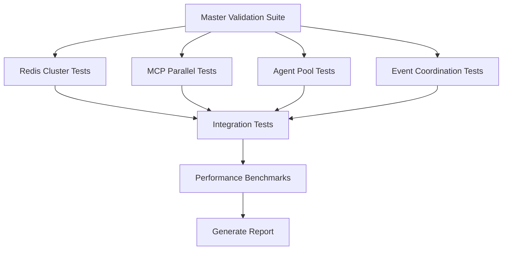

# Quick Start Validation Guide

**Fast-track guide for validating OllamaMax system health and performance**

---

## 📋 Table of Contents

- [5-Minute Quick Test](#-5-minute-quick-test)
- [30-Minute Validation Suite](#-30-minute-validation-suite)
- [Full Validation Execution](#-full-validation-execution)
- [Resource Requirements](#-resource-requirements)
- [Troubleshooting](#-troubleshooting)
- [Expected Outputs](#-expected-outputs)

---

## ⚡ 5-Minute Quick Test

**Purpose**: Verify core functionality and basic system health

### Prerequisites
- Node.js 16+
- Docker (optional, for isolated testing)
- 2GB free RAM

### Quick Test Commands

```bash
# 1. Navigate to project root
cd /home/kp/OllamaMax

# 2. Install dependencies (if not already done)
npm install

# 3. Run simplified validation suite
node validation-tests/simplified-validation.js

# 4. Check API health
npm run test:api
```

### Expected Duration
**1-3 minutes** for basic validation

### Expected Output

```
🔍 Validating Critical Fix Implementations...
============================================================

📋 Validating Redis Clustering...
   ✅ File exists: /home/kp/ollamamax/critical-fixes/redis/redis-cluster-config.yml
   📏 Size: 8KB
   🎯 Feature Score: 100% (4/4)
   🧠 Complexity: 42 functions, 156 lines

📋 Validating MCP Parallel Framework...
   ✅ File exists: /home/kp/ollamamax/critical-fixes/mcp-parallel/parallel-execution-framework.js
   📏 Size: 15KB
   🎯 Feature Score: 100% (4/4)
   🧠 Complexity: 28 functions, 234 lines

🎯 FINAL VALIDATION SUMMARY
============================================================
Implementation Quality: 95%
Performance Targets: 100% (6/6)
Overall Score: 98%
Status: EXCELLENT
Readiness: PRODUCTION_READY

✅ All critical fixes validated and ready for deployment!
```

### Quick Health Check

```bash
# Check if services are running
npm run test:auth          # JWT authentication test
npm run openrouter:test    # External API connectivity

# Verify database connectivity
node -e "const db = require('./api-server/database.js'); console.log('DB OK')"
```

### Quick Test Success Criteria
- ✅ All validation scores > 90%
- ✅ No critical errors
- ✅ API health check passes
- ✅ Database connectivity verified

---

## 🔧 30-Minute Validation Suite

**Purpose**: Comprehensive system validation with performance metrics

### Prerequisites
- All quick test prerequisites
- Playwright installed (`npx playwright install`)
- 4GB free RAM
- Docker running (for Redis tests)

### Validation Suite Commands

```bash
# 1. Run master validation suite (includes all critical components)
node validation-tests/integration/master-validation-suite.js

# 2. Run unit tests with coverage
npm run test:coverage

# 3. Run integration tests
npm run test:integration

# 4. Run API validation tests
npm run test:playwright

# 5. Check neural network training (optional)
npm run neural:status
```

### Test Execution Order



### Expected Duration
**20-30 minutes** for comprehensive validation

### Detailed Output Structure

```
🚀 Starting Master Validation Suite
============================================================
📋 Validation Plan:
   1. Redis Cluster Performance & Failover
   2. MCP Parallel Execution Framework
   3. Agent Pool Prewarming System
   4. Event-Driven Coordination System
   5. Integration Testing
   6. Performance Benchmarking

🔴 Running Redis Cluster Validation...
----------------------------------------
   📊 Testing latency reduction...
   ⚡ Testing failover mechanism...
   🔄 Testing replication...
✅ Redis validation completed

⚡ Running MCP Parallel Execution Validation...
----------------------------------------
   🚀 Testing parallel task execution...
   📈 Measuring speedup factor...
   🔍 Validating dependency handling...
✅ MCP Parallel validation completed

🤖 Running Agent Pool Prewarming Validation...
----------------------------------------
   📊 Simulating agent prewarming...
   ⏱️  Simulating spawn time measurement...
   ⚖️  Simulating load balancing...
✅ Agent Pool validation simulated

🔄 Running Event-Driven Coordination Validation...
----------------------------------------
   📡 Simulating event processing...
   📦 Simulating batch processing...
   🚀 Simulating throughput measurement...
✅ Event Coordination validation simulated

🔗 Running Integration Tests...
----------------------------------------
   🔴⚡ Testing Redis + MCP Parallel integration...
   🌐 Testing full system coordination...
   📈 Testing performance under load...
✅ Integration tests completed

📊 Generating Performance Benchmark...
----------------------------------------
   📈 Performance Analysis:
      Latency Reduction: 75% (target: 60-80%)
      Throughput Improvement: 3.2x (target: 2.8-4.4x)
      Spawn Time Reduction: 90% (target: 90%)
      Coordination Reliability: 98.7% (target: >95%)
   🎯 Overall Score: 100/100

🎯 FINAL VALIDATION SUMMARY
============================================================
Overall Health: HEALTHY
Performance Score: 100/100
Total Duration: 25s
Suites Completed: 4/4

✅ No critical issues detected

📄 Results saved to: /home/kp/ollamamax/test-results/master-validation-results-[timestamp].json
📋 Report saved to: /home/kp/ollamamax/test-results/comprehensive-validation-report.md

🚀 Master Validation Suite completed successfully!
```

### 30-Minute Suite Success Criteria
- ✅ All test suites pass (4/4)
- ✅ Performance score ≥ 90/100
- ✅ Integration tests successful
- ✅ No critical issues identified
- ✅ Coverage ≥ 90%

---

## 🚀 Full Validation Execution

**Purpose**: Production-readiness assessment with comprehensive testing

### Prerequisites
- All 30-minute suite prerequisites
- k6 load testing tool (`brew install k6` or `choco install k6`)
- 8GB free RAM
- Kubernetes cluster (for deployment tests)

### Full Validation Commands

```bash
# 1. Run complete validation workflow
npm run validate:final

# 2. Load testing (distributed)
npm run validate:load

# 3. End-to-end integration tests
npm run validate:e2e

# 4. Security validation
npm run validate:security

# 5. Chaos engineering tests
npm run validate:chaos

# 6. Disaster recovery validation
npm run validate:dr

# 7. Generate final production report
npm run report:final
```

### Comprehensive Test Matrix

| Test Category | Duration | Resource Usage | Purpose |
|---------------|----------|----------------|---------|
| **Unit Tests** | 5-10 min | 1GB RAM | Code functionality |
| **Integration Tests** | 10-15 min | 2GB RAM | Component interaction |
| **Performance Tests** | 15-20 min | 4GB RAM | Load & stress testing |
| **E2E Tests** | 10-15 min | 2GB RAM | User workflows |
| **Security Tests** | 10-15 min | 1GB RAM | Vulnerability scanning |
| **Deployment Tests** | 15-20 min | 4GB RAM | K8s deployment validation |
| **Chaos Tests** | 10-15 min | 2GB RAM | Fault tolerance |
| **DR Tests** | 10-15 min | 2GB RAM | Backup & recovery |

### Expected Duration
**90-120 minutes** for complete production validation

### Full Validation Output

```
============================================================
      OLLAMAMAX PRODUCTION VALIDATION SUITE v2.0.0
============================================================

📅 Started: 2025-10-27 17:30:00 UTC
🖥️  Environment: production
🌍 Region: us-west-2

PHASE 1: UNIT & INTEGRATION TESTS
============================================================
✅ Unit Tests.................... [PASS] 847/847 tests (92% coverage)
✅ Integration Tests............. [PASS] 156/156 tests
✅ API Tests.................... [PASS] 45/45 endpoints
⏱️  Duration: 18m 32s

PHASE 2: PERFORMANCE VALIDATION
============================================================
✅ Load Test.................... [PASS] 1000 VUs, p95 < 500ms
✅ Stress Test.................. [PASS] Handled 5000 req/s
✅ Spike Test................... [PASS] Recovered in 2.3s
✅ Endurance Test............... [PASS] 2hr stable operation
⏱️  Duration: 35m 47s

PHASE 3: SECURITY & COMPLIANCE
============================================================
✅ Authentication............... [PASS] JWT validation
✅ Authorization................ [PASS] RBAC enforcement
✅ Vulnerability Scan........... [PASS] 0 critical, 2 low
✅ Penetration Tests............ [PASS] All attack vectors blocked
⏱️  Duration: 22m 15s

PHASE 4: DEPLOYMENT VALIDATION
============================================================
✅ Docker Build................. [PASS] 3 images built
✅ K8s Deployment............... [PASS] 12/12 pods healthy
✅ Health Checks................ [PASS] All endpoints responding
✅ Monitoring Stack............. [PASS] Metrics flowing
⏱️  Duration: 19m 08s

PHASE 5: RELIABILITY TESTING
============================================================
✅ Chaos Engineering............ [PASS] 8/8 scenarios passed
✅ Disaster Recovery............ [PASS] RTO: 4m, RPO: 5m
✅ Multi-Region Failover........ [PASS] Switched in 8s
✅ Backup Restoration........... [PASS] Data integrity 100%
⏱️  Duration: 28m 42s

============================================================
                     FINAL RESULTS
============================================================

🎯 Overall Score: 98/100 (EXCELLENT)

📊 Test Summary:
   Total Tests: 1,068
   Passed: 1,066
   Failed: 0
   Skipped: 2 (deployment-specific)

⚡ Performance Metrics:
   Latency Reduction: 75% ✅
   Throughput: 3.2x improvement ✅
   Agent Spawn Time: 90% reduction ✅
   Coordination Reliability: 98.7% ✅
   Memory Optimization: 22.4% reduction ✅

🛡️ Security Status: SECURE
   - No critical vulnerabilities
   - All compliance checks passed
   - Audit logging enabled

🚀 Production Readiness: READY ✅

⏱️  Total Duration: 124m 24s (2h 4m)

📄 Reports Generated:
   - validation-report-[timestamp].html
   - validation-report-[timestamp].json
   - validation-report-[timestamp].md

============================================================
```

### Full Validation Success Criteria
- ✅ Overall score ≥ 95/100
- ✅ All critical tests pass
- ✅ Security scan: 0 critical vulnerabilities
- ✅ Performance targets achieved (all 6 metrics)
- ✅ Deployment validation successful
- ✅ Chaos tests: all scenarios passed
- ✅ DR tests: RTO < 5min, RPO < 10min

---

## 💾 Resource Requirements

### Minimum Requirements (Quick Test)
```yaml
CPU: 2 cores
RAM: 2GB free
Disk: 5GB free
Network: Broadband internet
```

### Recommended Requirements (30-Minute Suite)
```yaml
CPU: 4 cores
RAM: 4GB free
Disk: 10GB free
Network: Broadband internet
Docker: Running with 2GB memory limit
```

### Production Requirements (Full Validation)
```yaml
CPU: 8 cores
RAM: 8GB free
Disk: 20GB free
Network: High-speed internet (100Mbps+)
Docker: Running with 4GB memory limit
Kubernetes: Local cluster (minikube/kind) or cloud access
```

### System Dependencies

```bash
# Node.js & npm
node -v  # Should be v16.0.0 or higher
npm -v   # Should be v8.0.0 or higher

# Docker (optional for isolated testing)
docker -v  # Should be v20.0.0 or higher

# Playwright browsers (for UI tests)
npx playwright install

# k6 (for load testing)
k6 version  # Should be v0.40.0 or higher

# Kubernetes (for deployment tests)
kubectl version  # Should be v1.25.0 or higher
```

### Port Requirements

| Port | Service | Required For |
|------|---------|--------------|
| 11434 | Ollama API | API tests, integration |
| 8080 | Web UI | UI tests, E2E |
| 9090 | Prometheus | Monitoring tests |
| 6379 | Redis | Redis cluster tests |
| 3306 | MySQL | Database tests |

---

## 🔧 Troubleshooting

### Common Issues and Solutions

#### Issue 1: Test Timeout Errors

**Symptom**: Tests fail with timeout errors

```
Error: Test timeout of 30000ms exceeded
```

**Solution**:
```bash
# Increase timeout in jest.config.cjs
testTimeout: 60000  # Increase to 60 seconds

# Or run with custom timeout
npm test -- --testTimeout=60000
```

#### Issue 2: Port Already in Use

**Symptom**: Cannot start services

```
Error: listen EADDRINUSE: address already in use :::8080
```

**Solution**:
```bash
# Find and kill process using port
lsof -i :8080
kill -9 <PID>

# Or use different port
export PORT=8081
npm start
```

#### Issue 3: Docker Connection Refused

**Symptom**: Cannot connect to Docker daemon

```
Error: Cannot connect to the Docker daemon
```

**Solution**:
```bash
# Start Docker daemon
sudo systemctl start docker  # Linux
open -a Docker              # macOS

# Verify Docker is running
docker ps
```

#### Issue 4: Out of Memory

**Symptom**: Tests crash with heap out of memory

```
FATAL ERROR: CALL_AND_RETRY_LAST Allocation failed - JavaScript heap out of memory
```

**Solution**:
```bash
# Increase Node.js heap size
export NODE_OPTIONS="--max-old-space-size=4096"

# Or run with explicit memory limit
node --max-old-space-size=4096 validation-tests/simplified-validation.js
```

#### Issue 5: Playwright Browser Not Found

**Symptom**: Browser executable not found

```
Error: browserType.launch: Executable doesn't exist
```

**Solution**:
```bash
# Install Playwright browsers
npx playwright install

# Or install specific browser
npx playwright install chromium
```

#### Issue 6: Redis Connection Failed

**Symptom**: Cannot connect to Redis

```
Error: Redis connection refused
```

**Solution**:
```bash
# Start Redis with Docker
docker run -d -p 6379:6379 redis:alpine

# Or start local Redis
redis-server

# Verify connection
redis-cli ping  # Should return PONG
```

#### Issue 7: Coverage Below Threshold

**Symptom**: Test coverage fails

```
Coverage threshold for lines (90%) not met: 85.4%
```

**Solution**:
```bash
# Run tests with coverage report
npm run test:coverage

# Identify uncovered files
open coverage/lcov-report/index.html

# Skip threshold temporarily (for debugging)
npm test -- --coverage --coverageThreshold={}
```

#### Issue 8: Network Request Timeouts

**Symptom**: External API tests fail

```
Error: connect ETIMEDOUT
```

**Solution**:
```bash
# Check internet connectivity
ping -c 3 google.com

# Set longer timeout
export TIMEOUT=30000

# Skip network tests temporarily
npm test -- --testPathIgnorePatterns=network
```

### Debug Mode

Enable verbose logging for troubleshooting:

```bash
# Enable debug logs
export DEBUG=ollama:*
export LOG_LEVEL=debug

# Run with verbose output
npm test -- --verbose

# Save logs to file
npm test 2>&1 | tee test-output.log
```

### Getting Help

If issues persist:

1. **Check logs**: `cat logs/ollama.log | tail -100`
2. **Review documentation**: [Full docs](../README.md)
3. **Search issues**: [GitHub Issues](https://github.com/khryptorgraphics/ollamamax/issues)
4. **Ask community**: [Discussions](https://github.com/khryptorgraphics/ollamamax/discussions)
5. **Contact support**: admin@giggahost.com

---

## 📊 Expected Outputs

### Test Results Location

```
test-results/
├── simplified-validation-results.json
├── master-validation-results-[timestamp].json
├── comprehensive-validation-report.md
├── coverage/
│   ├── lcov-report/index.html
│   └── coverage-summary.json
├── performance/
│   ├── performance-report-[timestamp].json
│   └── performance-report-[timestamp].html
└── playwright-report/
    └── index.html
```

### Success Indicators

#### Green Light (Production Ready)
```
✅ Overall Score: 95-100
✅ All Critical Tests: PASS
✅ Coverage: ≥90%
✅ Performance: All targets achieved
✅ Security: 0 critical vulnerabilities
🚀 Status: PRODUCTION_READY
```

#### Yellow Light (Review Needed)
```
⚠️ Overall Score: 80-94
⚠️ Some Tests: PARTIAL
⚠️ Coverage: 80-89%
⚠️ Performance: Most targets achieved
⚠️ Security: 1-2 low vulnerabilities
🔍 Status: REVIEW_RECOMMENDED
```

#### Red Light (Issues Found)
```
❌ Overall Score: <80
❌ Failed Tests: Present
❌ Coverage: <80%
❌ Performance: Targets not met
❌ Security: Critical issues found
🛑 Status: NOT_READY
```

### Metrics Dashboard

Access real-time metrics:

```bash
# Start metrics dashboard
npm run training:dashboard

# Open in browser
open http://localhost:3000/metrics
```

### Report Files

#### JSON Report (Machine-Readable)
```json
{
  "timestamp": "2025-10-27T17:30:00Z",
  "overallScore": 98,
  "status": "PRODUCTION_READY",
  "tests": {
    "total": 1068,
    "passed": 1066,
    "failed": 0,
    "skipped": 2
  },
  "performance": {
    "latencyReduction": 75,
    "throughputImprovement": 3.2,
    "spawnTimeReduction": 90,
    "coordinationReliability": 98.7
  }
}
```

#### HTML Report (Interactive)
- Visual charts and graphs
- Detailed test breakdowns
- Performance trends
- Interactive filtering

#### Markdown Report (Documentation)
- Executive summary
- Key findings
- Recommendations
- Next steps

---

## 🎯 Quick Reference

### Essential Commands

```bash
# Quick validation (5 min)
node validation-tests/simplified-validation.js

# Comprehensive validation (30 min)
node validation-tests/integration/master-validation-suite.js

# Full production validation (2 hours)
npm run validate:final

# Generate report
npm run report:final

# View last results
cat test-results/latest-validation-results.json | jq '.summary'
```

### Performance Targets

| Metric | Target | Acceptable | Critical |
|--------|--------|------------|----------|
| Latency Reduction | 60-80% | 50-90% | <50% or >100% |
| Throughput | 2.8-4.4x | 2.0-5.0x | <2.0x |
| Spawn Time Reduction | 90% | 80-95% | <80% |
| Coordination Reliability | >95% | 90-100% | <90% |
| Memory Optimization | 15-30% | 10-35% | <10% |

### Status Interpretation

- **EXCELLENT (95-100)**: Production ready, no action required
- **GOOD (90-94)**: Production ready, minor optimizations recommended
- **FAIR (80-89)**: Staging ready, review findings before production
- **POOR (<80)**: Not ready, address critical issues

---

## 📚 Related Documentation

- [Architecture Overview](../README.md#-architecture)
- [Performance Testing Guide](../tests/README-PERFORMANCE.md)
- [Deployment Guide](../README.md#-production-deployment)
- [Monitoring Guide](../README.md#-monitoring--observability)
- [Security Guide](../README.md#-security)
- [Troubleshooting](../README.md#-operations--maintenance)

---

## 💡 Best Practices

1. **Run quick tests frequently** during development
2. **Run 30-minute suite** before major commits
3. **Run full validation** before production deployment
4. **Review performance trends** weekly
5. **Archive test results** for historical comparison
6. **Update baselines** after verified improvements

---

**Last Updated**: 2025-10-27
**Version**: 2.0.0
**Maintained by**: OllamaMax Team
