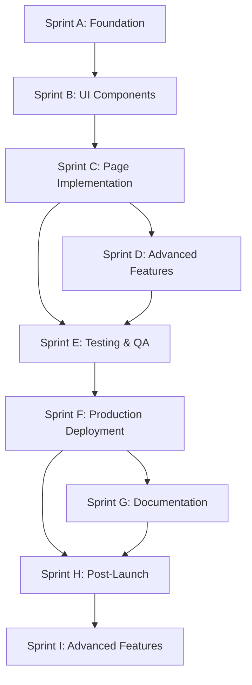

# Sprint Dependencies & Critical Path Analysis

## Dependency Graph Overview

## Critical Path Analysis

### Primary Critical Path (8 weeks)
1. **Sprint C** → **Sprint D** → **Sprint E** → **Sprint F** → **Sprint H**
   - This path represents the minimum viable product to production
   - Any delay in this path delays the entire project
   - Total duration: 6 weeks

### Secondary Paths
1. **Documentation Path**: Sprint C → Sprint G
   - Can run in parallel with Sprint D
   - Non-blocking for production

2. **Quality Path**: Sprint D → Sprint E → Sprint H
   - Essential for production readiness
   - Cannot be shortened without risk

## Inter-Sprint Dependencies

### Sprint C Dependencies
**Incoming**:
- ✅ Component library from Sprint B
- ✅ Design system from Sprint B
- ✅ Backend API endpoints (external)

**Outgoing**:
- Page components → Sprint D
- State management → Sprint D
- WebSocket connections → Sprint D

**Blocking Factors**:
- API endpoint availability
- WebSocket protocol finalization
- State management architecture decisions

### Sprint D Dependencies
**Incoming**:
- Page infrastructure from Sprint C
- State management from Sprint C
- Authentication system from Sprint C

**Outgoing**:
- Feature components → Sprint E
- Performance baselines → Sprint H
- Training UI → Sprint I

**Blocking Factors**:
- Model inference API readiness
- Training orchestrator availability
- Complex state management patterns

### Sprint E Dependencies
**Incoming**:
- All features from Sprint D
- Core pages from Sprint C
- Component library from Sprint B

**Outgoing**:
- Test results → Sprint F
- Bug fixes → Sprint F
- Performance metrics → Sprint H

**Blocking Factors**:
- Test environment availability
- Security scanning tools
- QA resource availability

### Sprint F Dependencies
**Incoming**:
- Tested application from Sprint E
- Infrastructure requirements from Sprint C/D
- Security clearance from Sprint E

**Outgoing**:
- Production environment → Sprint G, H
- Monitoring stack → Sprint H
- Deployment pipeline → All future sprints

**Blocking Factors**:
- Cloud infrastructure access
- Security approvals
- SSL certificates

### Sprint G Dependencies
**Incoming**:
- Completed features from Sprint D
- Production deployment from Sprint F
- API specifications from Sprint C/D

**Outgoing**:
- User guides → Sprint H
- Training materials → Sprint H
- API documentation → Sprint I

**Blocking Factors**:
- Technical writer availability
- Video production resources
- Translation services

### Sprint H Dependencies
**Incoming**:
- Production deployment from Sprint F
- User feedback from Sprint F launch
- Documentation from Sprint G

**Outgoing**:
- Performance improvements → Sprint I
- Updated roadmap → Future sprints
- Optimization patterns → Sprint I

**Blocking Factors**:
- User feedback volume
- Production issues priority
- Performance bottlenecks

### Sprint I Dependencies
**Incoming**:
- Stable platform from Sprint H
- Performance baselines from Sprint H
- Customer requirements

**Outgoing**:
- Enterprise features → Future releases
- Plugin SDK → Community
- Advanced analytics → Business team

**Blocking Factors**:
- Business priorities
- Technical complexity
- Resource allocation

## Resource Dependencies

### Human Resources
| Sprint | Required Resources | Availability Risk |
|--------|-------------------|------------------|
| C | 3-4 Full-stack devs | Low |
| D | 4 Full-stack devs | Low |
| E | 2 Devs + 1 QA | Medium (QA availability) |
| F | 2 Devs + 1 DevOps | High (DevOps specialist) |
| G | 2 Devs + 1 Tech Writer | High (Tech writer) |
| H | 3 Full-stack devs | Low |
| I | 4 Senior devs | Medium |

### Technical Resources
| Resource | Required By | Critical For |
|----------|------------|--------------|
| GPU Nodes | Sprint D | Training UI testing |
| Kubernetes Cluster | Sprint F | Production deployment |
| CDN | Sprint H | Performance optimization |
| Monitoring Stack | Sprint F | Production observability |
| CI/CD Pipeline | Sprint E | Automated testing |

### External Services
| Service | Sprint | Dependency Type | Mitigation |
|---------|--------|----------------|------------|
| Auth Provider | C, D | Critical | Mock service |
| Model Registry | D | Critical | Local registry |
| Storage Backend | C, D | Critical | MinIO for dev |
| CDN | H | Optional | Direct serving |
| Analytics | H, I | Optional | Self-hosted |

## Dependency Risk Matrix

### High Risk Dependencies
1. **Backend API Readiness** (Sprint C)
   - Impact: Blocks entire frontend development
   - Mitigation: Mock data, parallel development
   - Owner: Backend team

2. **DevOps Resource** (Sprint F)
   - Impact: Delays production deployment
   - Mitigation: Early knowledge transfer, documentation
   - Owner: Project manager

3. **Model Inference API** (Sprint D)
   - Impact: Blocks advanced features
   - Mitigation: Simulator, staged rollout
   - Owner: ML team

### Medium Risk Dependencies
1. **QA Resource** (Sprint E)
   - Impact: Reduced test coverage
   - Mitigation: Developer testing, automation
   - Owner: QA manager

2. **Technical Writer** (Sprint G)
   - Impact: Delayed documentation
   - Mitigation: Developer-written docs, templates
   - Owner: Documentation team

3. **GPU Resources** (Sprint D)
   - Impact: Limited testing capability
   - Mitigation: Cloud GPU rental, time-sharing
   - Owner: Infrastructure team

### Low Risk Dependencies
1. **Component Library** (Sprint C)
   - Impact: Minor UI inconsistencies
   - Mitigation: Already completed in Sprint B
   - Owner: Frontend team

2. **Monitoring Tools** (Sprint F)
   - Impact: Reduced observability
   - Mitigation: Open-source alternatives
   - Owner: DevOps team

## Parallel Execution Opportunities

### Can Run in Parallel
- Sprint G (Documentation) with Sprint D/E
- Parts of Sprint E (Testing) with late Sprint D
- Sprint H optimization with Sprint G documentation
- Infrastructure setup (Sprint F) can start during Sprint E

### Must Run Sequentially
- Sprint C → Sprint D (features need pages)
- Sprint E → Sprint F (testing before deployment)
- Sprint F → Sprint H (need production for optimization)

### Optimization Strategies
1. **Early Start**: Begin Sprint F infrastructure during Sprint E
2. **Parallel Tracks**: Documentation team starts during Sprint D
3. **Continuous Testing**: QA involvement from Sprint C
4. **Progressive Deployment**: Staged rollout during Sprint F

## Contingency Plans

### If Sprint C is Delayed
- Impact: 1-2 week overall delay
- Mitigation: 
  - Start Sprint D with mocked pages
  - Parallel development of independent features
  - Increase team size temporarily

### If Sprint E Finds Critical Issues
- Impact: 3-5 day delay
- Mitigation:
  - Hotfix team during Sprint F
  - Staged deployment strategy
  - Feature flags for problematic areas

### If Sprint F Deployment Fails
- Impact: 1 week delay minimum
- Mitigation:
  - Rollback plan ready
  - Blue-green deployment
  - Feature flags for gradual rollout

## Resource Leveling Strategy

### Week-by-Week Resource Allocation
| Week | Sprint | Developers | QA | DevOps | Writer |
|------|--------|-----------|-----|--------|--------|
| 1-2 | C | 4 | 0 | 0 | 0 |
| 3-4 | D | 4 | 0.5 | 0 | 0 |
| 5 | E | 2 | 1 | 0.5 | 0 |
| 6 | F | 2 | 0 | 1 | 0 |
| 7 | G | 2 | 0 | 0 | 1 |
| 8 | H | 3 | 0 | 0.5 | 0 |
| 9 | I | 4 | 0 | 0 | 0 |

### Resource Optimization
1. **Cross-training**: Developers learn DevOps basics
2. **Documentation**: Developers write initial docs
3. **Automation**: Reduce QA manual effort
4. **Pair Programming**: Knowledge sharing
5. **Part-time Allocation**: DevOps and Writers as needed

## Success Metrics for Dependencies

### Dependency Resolution Metrics
- **On-time Delivery Rate**: >90% of dependencies delivered on schedule
- **Blocking Time**: <4 hours average blocking time
- **Alternative Implementation**: 100% of critical deps have alternatives
- **Communication Lag**: <2 hours for dependency status updates

### Risk Mitigation Effectiveness
- **Risk Materialization**: <20% of identified risks occur
- **Mitigation Success**: >80% of mitigations prevent impact
- **Recovery Time**: <1 day for dependency failures
- **Cost Impact**: <10% budget impact from dependencies

---

*This document should be reviewed weekly and updated as dependencies evolve.*