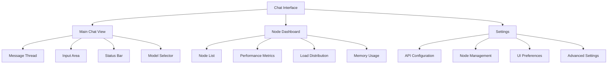
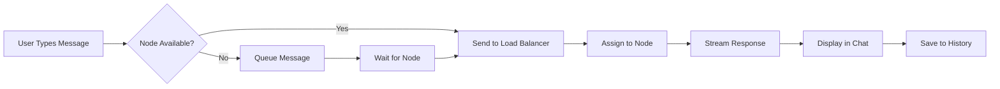
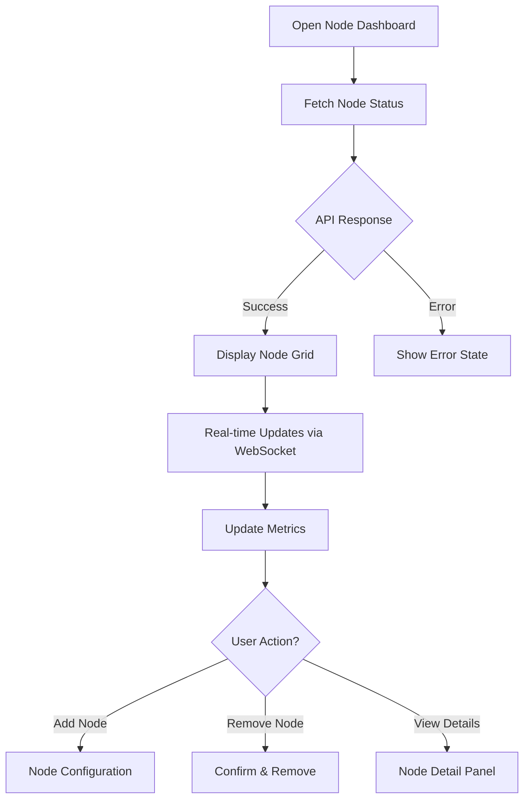

# Distributed Llama Chat Interface - UI/UX Specification

## Introduction

This document defines the user experience goals, information architecture, user flows, and visual design specifications for the Distributed Llama Chat Interface. It serves as the foundation for visual design and frontend development, ensuring a cohesive and user-centered experience for distributed AI inference across multiple nodes.

### Overall UX Goals & Principles

#### Target User Personas

1. **AI Developer:** Technical professionals deploying and managing distributed inference nodes
   - Needs: Performance metrics, node health monitoring, configuration control
   - Goals: Optimize inference speed, manage resources efficiently

2. **End User:** Individuals using the chat interface for AI interactions
   - Needs: Simple, responsive chat experience, clear feedback
   - Goals: Get accurate AI responses quickly without technical complexity

3. **System Administrator:** IT professionals managing the infrastructure
   - Needs: Node management, load balancing insights, system health
   - Goals: Maintain uptime, distribute load effectively

#### Usability Goals

- **Instant Feedback:** Real-time typing indicators and streaming responses
- **Node Transparency:** Clear indication of which node is processing
- **Performance Visibility:** Live metrics for inference speed and queue status
- **Error Recovery:** Graceful handling of node failures with automatic failover
- **Accessibility:** WCAG 2.1 AA compliance for all interface elements

#### Design Principles

1. **Real-time First** - All interactions should feel immediate with WebSocket connections
2. **Progressive Information** - Show basic chat first, reveal technical details on demand
3. **Visual System Status** - Always show what's happening across the distributed system
4. **Resilient by Design** - Interface should adapt seamlessly to node changes
5. **Performance Metrics** - Make system performance visible but not intrusive

### Change Log

| Date | Version | Description | Author |
|------|---------|-------------|--------|
| 2025-09-02 | 1.0 | Initial specification | Sally (UX Expert) |

## Information Architecture (IA)

### Site Map / Screen Inventory

### Navigation Structure

**Primary Navigation:** Tabbed interface with Chat (default), Nodes, and Settings

**Secondary Navigation:** Context menus for message actions, node operations

**Breadcrumb Strategy:** Not needed due to shallow hierarchy

## User Flows

### Primary Chat Flow

**User Goal:** Send a message and receive AI response

**Entry Points:** Main chat interface on load

**Success Criteria:** Response received and displayed within expected timeframe

#### Flow Diagram

#### Edge Cases & Error Handling:
- All nodes offline: Display offline message, queue for when available
- Node fails mid-response: Automatic failover to another node
- Network interruption: Reconnect WebSocket, resume from last position
- Rate limiting: Show remaining quota and reset time

### Node Management Flow

**User Goal:** Monitor and manage distributed nodes

**Entry Points:** Node Dashboard tab

**Success Criteria:** Can view all nodes and their status

#### Flow Diagram

## Wireframes & Mockups

### Key Screen Layouts

#### Main Chat Interface

**Purpose:** Primary interface for AI chat interactions

**Key Elements:**
- Message thread with sender indicators (user/AI/system)
- Streaming response with typing indicator
- Node status indicator showing active processing node
- Model selector dropdown
- Input field with send button and file attachment
- Performance metrics bar (collapsible)

**Interaction Notes:** 
- Enter key sends message, Shift+Enter for new line
- Responses stream character by character
- Click node indicator for detailed metrics

#### Node Dashboard

**Purpose:** Monitor and manage distributed inference nodes

**Key Elements:**
- Grid view of all nodes with health indicators
- Real-time performance charts (requests/sec, latency, memory)
- Load distribution visualization
- Add/Remove node buttons
- Node detail modal with logs

**Interaction Notes:**
- Auto-refresh every 5 seconds
- Drag to reorder node priority
- Click node card for detailed view

## Component Library / Design System

### Design System Approach

Using a custom component library based on modern web standards with Web Components for maximum compatibility

### Core Components

#### ChatMessage
**Purpose:** Display individual messages in the chat thread

**Variants:** User message, AI response, System notification

**States:** Sending, Delivered, Streaming, Complete, Error

**Usage Guidelines:** Always show timestamp on hover, indicate edit capability for user messages

#### NodeCard
**Purpose:** Display node status and metrics

**Variants:** Healthy, Warning, Error, Offline

**States:** Default, Hover, Selected, Processing

**Usage Guidelines:** Use color coding for quick status recognition, show sparkline for recent activity

#### StreamingText
**Purpose:** Display AI responses as they stream in

**Variants:** Text only, Code block, Mixed content

**States:** Streaming, Paused, Complete

**Usage Guidelines:** Show cursor during streaming, syntax highlight code blocks

## Branding & Style Guide

### Visual Identity

**Brand Guidelines:** Modern, technical, trustworthy

### Color Palette

| Color Type | Hex Code | Usage |
|------------|----------|-------|
| Primary | #667eea | Headers, primary actions |
| Secondary | #764ba2 | Accents, hover states |
| Accent | #48bb78 | Success, online status |
| Success | #38a169 | Positive feedback, confirmations |
| Warning | #ed8936 | Warnings, degraded performance |
| Error | #e53e3e | Errors, offline nodes |
| Neutral | #2d3748 | Text, borders, backgrounds |

### Typography

#### Font Families
- **Primary:** Inter, system-ui, sans-serif
- **Secondary:** Inter, system-ui, sans-serif
- **Monospace:** 'Fira Code', 'Courier New', monospace

#### Type Scale

| Element | Size | Weight | Line Height |
|---------|------|--------|-------------|
| H1 | 2rem | 700 | 1.2 |
| H2 | 1.5rem | 600 | 1.3 |
| H3 | 1.25rem | 600 | 1.4 |
| Body | 1rem | 400 | 1.6 |
| Small | 0.875rem | 400 | 1.5 |

### Iconography

**Icon Library:** Heroicons v2

**Usage Guidelines:** Use outline style for navigation, solid for actions

### Spacing & Layout

**Grid System:** 12-column responsive grid

**Spacing Scale:** 4px base unit (4, 8, 12, 16, 24, 32, 48, 64)

## Accessibility Requirements

### Compliance Target

**Standard:** WCAG 2.1 Level AA

### Key Requirements

**Visual:**
- Color contrast ratios: 4.5:1 for normal text, 3:1 for large text
- Focus indicators: 2px solid outline with 2px offset
- Text sizing: Minimum 14px, user scalable to 200%

**Interaction:**
- Keyboard navigation: All interactive elements keyboard accessible
- Screen reader support: Proper ARIA labels and live regions
- Touch targets: Minimum 44x44px

**Content:**
- Alternative text: All images and icons have descriptive alt text
- Heading structure: Logical h1-h6 hierarchy
- Form labels: All inputs have associated labels

### Testing Strategy

Automated testing with axe-core, manual testing with screen readers

## Responsiveness Strategy

### Breakpoints

| Breakpoint | Min Width | Max Width | Target Devices |
|------------|-----------|-----------|----------------|
| Mobile | 320px | 767px | Phones |
| Tablet | 768px | 1023px | Tablets |
| Desktop | 1024px | 1919px | Laptops/Desktops |
| Wide | 1920px | - | Large monitors |

### Adaptation Patterns

**Layout Changes:** Stack sidebar on mobile, side-by-side on desktop

**Navigation Changes:** Hamburger menu on mobile, persistent nav on desktop

**Content Priority:** Hide performance metrics on mobile by default

**Interaction Changes:** Touch gestures on mobile, hover states on desktop

## Animation & Micro-interactions

### Motion Principles

Subtle, purposeful animations that enhance usability without distraction

### Key Animations

- **Message Appear:** Fade in from bottom (Duration: 200ms, Easing: ease-out)
- **Typing Indicator:** Pulsing dots (Duration: 1s loop, Easing: ease-in-out)
- **Node Status Change:** Color transition (Duration: 300ms, Easing: ease)
- **Panel Slide:** Slide in from right (Duration: 250ms, Easing: ease-out)

## Performance Considerations

### Performance Goals

- **Page Load:** < 2 seconds initial load
- **Interaction Response:** < 100ms for user actions
- **Animation FPS:** Consistent 60fps

### Design Strategies

- Lazy load node dashboard components
- Virtual scrolling for long message histories
- Optimize WebSocket payloads
- Use CSS transforms for animations

## Next Steps

### Immediate Actions

1. Implement WebSocket connection manager
2. Create base chat component architecture
3. Set up Docker Swarm test environment
4. Develop API client with failover logic

### Design Handoff Checklist

- [x] All user flows documented
- [x] Component inventory complete
- [x] Accessibility requirements defined
- [x] Responsive strategy clear
- [x] Brand guidelines incorporated
- [x] Performance goals established

---

*Specification created by Sally (UX Expert) - BMAD Framework*