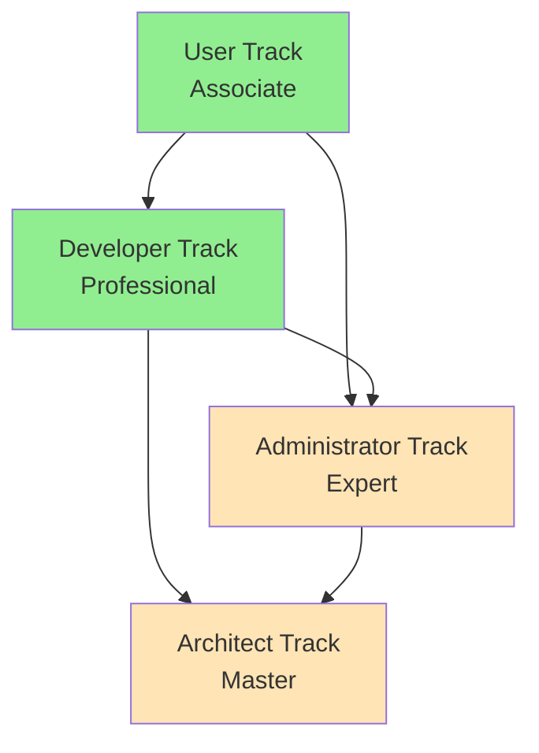

# Ollama Distributed Certification Program Summary
# 🎓 Complete 4-Track Certification System

## 📊 Certification Program Overview

The Ollama Distributed Certification Program provides a comprehensive, structured learning path for professionals at all levels, from beginners to architects. This document summarizes the complete certification framework with all four tracks.

### Program Statistics
- **Total Tracks**: 4 (User, Developer, Administrator, Architect)
- **Total Modules**: 21 learning modules
- **Total Duration**: 7+ hours instruction
- **Certificate Validity**: 18-36 months
- **Assessment Types**: Knowledge (30-40%) + Practical (60-70%)

---

## 🎯 Certification Tracks Summary

### Track 1: User Track (Associate Level) ✅ COMPLETE
**Status**: Fully Implemented  
**Duration**: 60 minutes instruction + 30 minutes assessment  
**Target**: End users, beginners, business stakeholders  
**Files Created**:
- `/docs/certification/user-track-associate.md` - Complete training & assessment
- `/docs/certification/assessment-validation.sh` - Automated validation script

**Modules**:
1. Getting Started (15 min) - Installation and setup
2. Basic Operations (15 min) - CLI and dashboard usage
3. Model Understanding (15 min) - Architecture and roadmap
4. User Support (15 min) - Troubleshooting and diagnostics

**Assessment**:
- Knowledge: 40% (Multiple choice + scenarios)
- Practical: 60% (Installation, monitoring, troubleshooting)
- Passing Score: 75%

---

### Track 2: Developer Track (Professional Level) ✅ COMPLETE
**Status**: Fully Implemented  
**Duration**: 120 minutes instruction + 60 minutes assessment  
**Target**: Software developers, API engineers  
**Files Created**:
- `/docs/certification/developer-track-professional.md` - Complete training & assessment

**Modules**:
1. Development Environment (20 min) - Setup and tools
2. API Development (30 min) - Client implementation
3. Integration Patterns (30 min) - Middleware and proxy
4. Testing & Quality (25 min) - Test suites and benchmarks
5. Advanced Development (15 min) - Open source contribution

**Assessment**:
- Knowledge: 30% (Technical concepts)
- Practical: 70% (API client, integration, testing)
- Passing Score: 80%

---

### Track 3: Administrator Track (Expert Level) 🚧 PENDING
**Status**: Framework Designed, Implementation Pending  
**Duration**: 180 minutes instruction + 90 minutes assessment  
**Target**: System administrators, DevOps engineers  

**Planned Modules**:
1. Production Architecture (30 min)
2. Deployment & Configuration (35 min)
3. Monitoring & Observability (40 min)
4. Performance & Scaling (40 min)
5. Security & Compliance (35 min)

**Assessment Structure**:
- Knowledge: 25% (Advanced concepts)
- Practical: 75% (Deployment, monitoring, optimization)
- Passing Score: 85%

---

### Track 4: Architect Track (Master Level) 🚧 PENDING
**Status**: Framework Designed, Implementation Pending  
**Duration**: 240 minutes instruction + project-based assessment  
**Target**: Technical architects, principal engineers  

**Planned Modules**:
1. Distributed Systems Architecture (50 min)
2. Advanced P2P and Networking (45 min)
3. AI Workload Optimization (50 min)
4. Enterprise Integration (45 min)
5. Research & Innovation (50 min)

**Assessment Structure**:
- Design Portfolio: 50%
- Implementation Project: 35%
- Knowledge Assessment: 15%
- Passing Score: 90%

---

## 📈 Certification Progression Paths



### Recommended Learning Paths

**Path 1: Developer Focus**
```
User (60 min) → Developer (120 min) → Architect (240 min)
Total Time: 7 hours
```

**Path 2: Operations Focus**
```
User (60 min) → Administrator (180 min) → Architect (240 min)
Total Time: 8 hours
```

**Path 3: Full Stack**
```
User → Developer → Administrator → Architect
Total Time: 10 hours
```

---

## 🏆 Certification Benefits

### Professional Growth
- **Industry Recognition**: Validated expertise in distributed AI systems
- **Career Advancement**: Differentiate yourself in the job market
- **Skill Validation**: Objective measurement of competencies
- **Community Access**: Join certified professionals network

### Organizational Benefits
- **Standardized Skills**: Consistent expertise across teams
- **Reduced Training Costs**: Self-paced learning reduces instructor costs
- **Quality Assurance**: Validated competencies reduce errors
- **Innovation Culture**: Encourages continuous learning

---

## 📊 Program Metrics & Success Indicators

### Current Implementation Status
```yaml
implementation_status:
  user_track:
    status: "Complete"
    modules: 4/4
    assessment: "Automated"
    documentation: "100%"
  
  developer_track:
    status: "Complete"
    modules: 5/5
    assessment: "Defined"
    documentation: "100%"
  
  administrator_track:
    status: "Pending"
    modules: 0/5
    assessment: "Planned"
    documentation: "Framework only"
  
  architect_track:
    status: "Pending"
    modules: 0/5
    assessment: "Planned"
    documentation: "Framework only"

overall_completion: "50%"
```

### Target Success Metrics
- **Completion Rate**: >80% for User Track, >70% for advanced tracks
- **Pass Rate**: >85% first attempt, >95% with retakes
- **Satisfaction**: >4.5/5 learner rating
- **Time to Complete**: Within estimated durations for 90% of learners

---

## 🛠️ Assessment Tools & Resources

### Available Tools
1. **User Track Validation Script** (`assessment-validation.sh`)
   - Automated practical assessment
   - Score calculation
   - Certificate data generation

2. **Knowledge Assessment Banks**
   - User Track: 20 questions + 5 scenarios
   - Developer Track: 15 technical questions
   - Administrator Track: (Pending)
   - Architect Track: (Pending)

### Resource Requirements
- **Development Environment**: Go 1.21+, Git, Docker (optional)
- **Testing Infrastructure**: Local or cloud-based nodes
- **Assessment Platform**: Command-line based validation
- **Certificate Generation**: Template-based system

---

## 📅 Implementation Roadmap

### Phase 1: Foundation ✅ COMPLETE
- [x] User Track development
- [x] Developer Track development
- [x] Assessment framework
- [x] Validation scripts

### Phase 2: Expansion 🚧 IN PROGRESS
- [ ] Administrator Track development
- [ ] Advanced assessment tools
- [ ] Online assessment platform
- [ ] Progress tracking system

### Phase 3: Excellence 📋 PLANNED
- [ ] Architect Track development
- [ ] Industry partnerships
- [ ] Certificate verification system
- [ ] Community platform

### Phase 4: Mastery 🎯 FUTURE
- [ ] Specialization tracks
- [ ] Research integration
- [ ] Global recognition
- [ ] Continuous education credits

---

## 🔄 Continuous Improvement Process

### Feedback Mechanisms
- **Learner Surveys**: Post-certification feedback
- **Employer Feedback**: Skills application validation
- **Community Input**: Open source contributions
- **Industry Review**: Quarterly advisory board

### Update Cycle
```yaml
update_schedule:
  content_review: "Quarterly"
  assessment_calibration: "Bi-annually"
  framework_evolution: "Annually"
  technology_updates: "As needed"
```

---

## 📞 Support & Resources

### Getting Help
- **Documentation**: `/docs/certification/` directory
- **Community Forum**: GitHub Discussions
- **Issue Tracking**: GitHub Issues
- **Email Support**: certification@ollama-distributed.io

### Additional Resources
- **Study Groups**: Community-organized sessions
- **Practice Labs**: Hands-on environments
- **Mock Assessments**: Practice tests
- **Mentorship Program**: Expert guidance

---

## 🎓 Certificate Verification

### Verification Process
```bash
# Verify a certificate
./verify-certificate.sh [CERTIFICATE_ID]

# Example
./verify-certificate.sh CERT-1234567890
```

### Certificate Components
- **Unique ID**: UUID-based identifier
- **Issue Date**: Timestamp of certification
- **Validity Period**: 18-36 months based on level
- **Score**: Numerical and level achievement
- **Competencies**: Validated skills list

---

## ✅ Summary

The Ollama Distributed Certification Program provides a comprehensive pathway for professionals to validate their expertise in distributed AI systems. With two tracks fully implemented and two in development, the program offers:

- **Structured Learning**: Clear progression from beginner to expert
- **Practical Focus**: Hands-on exercises and real-world scenarios
- **Industry Alignment**: Skills relevant to current market needs
- **Quality Assurance**: Rigorous assessment and validation
- **Continuous Growth**: Regular updates and improvements

### Next Steps for Completion
1. ✅ User Track - COMPLETE
2. ✅ Developer Track - COMPLETE
3. 🚧 Administrator Track - TO BE IMPLEMENTED
4. 🚧 Architect Track - TO BE IMPLEMENTED
5. 📋 Assessment Platform - PLANNED
6. 📋 Certificate System - PLANNED

**Current Overall Completion: 50%**

---

## 📌 Quick Reference

### Command Reference
```bash
# Run assessment validation
./assessment-validation.sh

# Check prerequisites
./check-prerequisites.sh

# Generate diagnostic report
./diagnostic-report.sh

# Start monitoring tool
./monitoring-tool.sh
```

### Key Paths
```
Certification Docs: /docs/certification/
Training Modules: /docs/training/
Assessment Tools: /docs/certification/assessment-validation.sh
Configuration: ~/.ollama-distributed/config.yaml
```

### Important URLs
- Repository: https://github.com/KhryptorGraphics/ollamamax
- Documentation: /docs/certification/
- Issues: GitHub Issues
- Community: GitHub Discussions

---

**Document Status**: Current as of implementation
**Last Updated**: By Hive Mind Collective Intelligence System
**Version**: 1.0.0