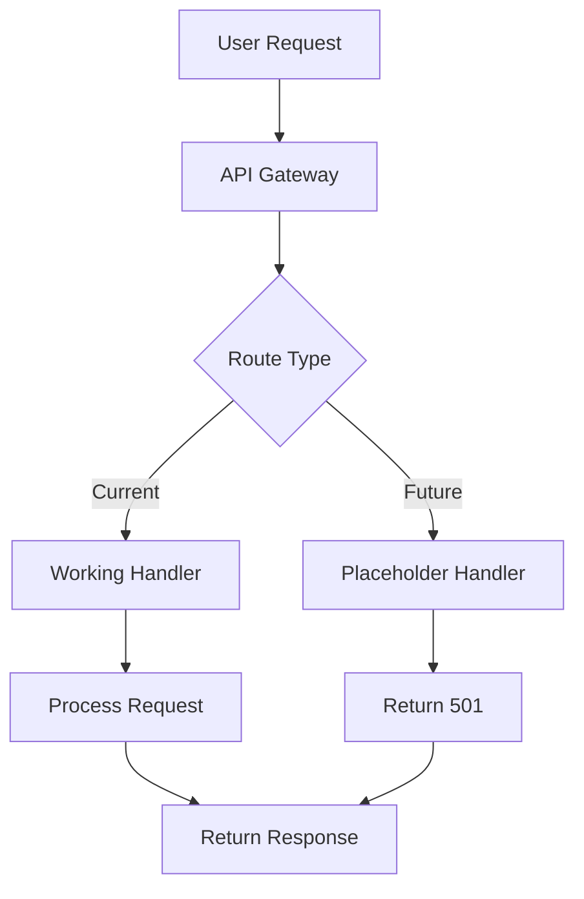

# Ollama Distributed User Track Certification (Associate Level)
# 🎓 Complete Training & Assessment Guide

## 📋 Certification Overview

**Track**: User Track  
**Level**: Associate  
**Duration**: 60 minutes instruction + 30 minutes assessment  
**Target Audience**: End users, beginners, business stakeholders  
**Prerequisites**: Basic computer literacy, command-line willingness  

### Certification Objectives
Upon successful completion, certified associates will demonstrate:
- ✅ Proficiency in Ollama Distributed installation and setup
- ✅ Competency in basic operations and monitoring
- ✅ Understanding of distributed AI concepts
- ✅ Ability to troubleshoot common issues
- ✅ Knowledge of system architecture and roadmap

---

## 📚 Module 1.1: Getting Started (15 minutes)

### Learning Objectives
- Install Ollama Distributed on your system
- Complete initial setup and validation
- Understand system requirements and limitations

### Pre-Module Assessment
```yaml
knowledge_check:
  - question: "What is the minimum Go version required?"
    answer: "1.21+"
  - question: "How much disk space is needed?"
    answer: "2GB minimum"
  - question: "What is the recommended RAM?"
    answer: "4GB+"
```

### Hands-On Exercise 1.1.A: System Preparation

```bash
#!/bin/bash
# System Requirements Validation Script
echo "🔍 Checking System Requirements..."

# Check Go version
GO_VERSION=$(go version | awk '{print $3}' | sed 's/go//')
echo "✓ Go version: $GO_VERSION"

# Check disk space
DISK_SPACE=$(df -h ~ | awk 'NR==2 {print $4}')
echo "✓ Available disk space: $DISK_SPACE"

# Check memory
MEMORY=$(free -h | awk 'NR==2 {print $2}')
echo "✓ Total memory: $MEMORY"

# Validation result
if [[ $? -eq 0 ]]; then
  echo "✅ System meets requirements"
else
  echo "❌ System check failed"
fi
```

### Hands-On Exercise 1.1.B: Installation

```bash
# Step 1: Clone repository
cd ~/workspace
git clone https://github.com/KhryptorGraphics/ollamamax.git
cd ollamamax/ollama-distributed

# Step 2: Build from source
echo "🔨 Building Ollama Distributed..."
go build -o bin/ollama-distributed ./cmd/distributed-ollama

# Step 3: Verify installation
./bin/ollama-distributed --version

# Step 4: Add to PATH
echo 'export PATH=$PATH:'$(pwd)'/bin' >> ~/.bashrc
source ~/.bashrc
```

### Knowledge Check 1.1
1. **What files are created during installation?**
   - Binary: `bin/ollama-distributed`
   - Config: `~/.ollama-distributed/config.yaml` (after setup)
   - Logs: `~/.ollama-distributed/logs/`

2. **What are the main components installed?**
   - CLI tool
   - P2P networking module
   - API server
   - Web dashboard

### Practical Validation 1.1
```bash
# Validation commands
ollama-distributed --version  # Should show version
ollama-distributed help       # Should show command list
ls -la bin/                  # Should show binary
```

**✅ Module 1.1 Complete**: You can now install Ollama Distributed

---

## 📚 Module 1.2: Basic Operations (15 minutes)

### Learning Objectives
- Navigate the web dashboard interface
- Execute basic CLI commands
- Monitor system health and status

### Hands-On Exercise 1.2.A: CLI Mastery

```bash
# Essential CLI Commands Reference
ollama-distributed setup      # Interactive configuration
ollama-distributed start      # Start the node
ollama-distributed status     # Check node status
ollama-distributed stop       # Stop the node
ollama-distributed validate   # Validate configuration
ollama-distributed health     # Health check
```

### Hands-On Exercise 1.2.B: Create Monitoring Script

```bash
#!/bin/bash
# monitoring-tool.sh - User-created monitoring utility
set -e

echo "📊 Ollama Distributed Monitor v1.0"
echo "=================================="

while true; do
  clear
  echo "🕐 $(date)"
  echo ""
  
  # Check if service is running
  if pgrep -f "ollama-distributed" > /dev/null; then
    echo "✅ Status: RUNNING"
    
    # Get health status
    HEALTH=$(curl -s http://localhost:8080/health | jq -r '.status')
    echo "🏥 Health: $HEALTH"
    
    # Get metrics
    curl -s http://localhost:8080/metrics | head -5
  else
    echo "❌ Status: STOPPED"
  fi
  
  echo ""
  echo "Press Ctrl+C to exit"
  sleep 5
done
```

### Web Dashboard Navigation Guide

```markdown
Dashboard Sections:
├── Overview Tab
│   ├── Node Status Widget
│   ├── Resource Usage Graph
│   └── Recent Activity Log
├── Configuration Tab
│   ├── Current Settings
│   ├── Edit Configuration
│   └── Apply Changes
├── Monitoring Tab
│   ├── Real-time Metrics
│   ├── Historical Data
│   └── Export Reports
└── Help Tab
    ├── Documentation Links
    ├── Troubleshooting Guide
    └── Support Contact
```

### Knowledge Check 1.2
1. **Which port does the API server use by default?** `8080`
2. **Which port does the web dashboard use?** `8081`
3. **What endpoint provides health status?** `/health`
4. **What command shows all available CLI options?** `ollama-distributed help`

### Practical Validation 1.2
- Create and run the monitoring script
- Access web dashboard at http://localhost:8081
- Successfully execute 5 different CLI commands
- Generate a status report

**✅ Module 1.2 Complete**: You can now operate Ollama Distributed

---

## 📚 Module 1.3: Model Understanding (15 minutes)

### Learning Objectives
- Understand model management architecture
- Distinguish between working and placeholder features
- Learn development roadmap and future capabilities

### Conceptual Overview

```yaml
model_architecture:
  current_features:
    status: "Foundation Complete"
    components:
      - "P2P networking layer"
      - "Basic API endpoints"
      - "Configuration management"
      - "Health monitoring"
  
  in_development:
    status: "Active Development"
    components:
      - "Model distribution system"
      - "Inference engine"
      - "Model caching layer"
      - "Load balancing"
  
  future_roadmap:
    q1_2024:
      - "Model management API"
      - "Basic inference support"
    q2_2024:
      - "Distributed inference"
      - "Model sharding"
    q3_2024:
      - "Auto-scaling"
      - "Advanced caching"
```

### API Endpoint Reference

```javascript
// Current Working Endpoints
GET  /health          // Health check
GET  /status          // Node status
GET  /metrics         // Performance metrics
POST /config          // Update configuration

// Placeholder Endpoints (Future)
POST /models/load     // Load a model (not implemented)
POST /models/infer    // Run inference (not implemented)
GET  /models/list     // List models (returns empty)
DEL  /models/{id}     // Unload model (not implemented)
```

### Hands-On Exercise 1.3: API Exploration

```bash
# Test current endpoints
curl http://localhost:8080/health
curl http://localhost:8080/status
curl http://localhost:8080/metrics

# Understand placeholder responses
curl -X POST http://localhost:8080/models/load \
  -H "Content-Type: application/json" \
  -d '{"model": "llama2"}'
# Expected: {"error": "Not implemented", "status": 501}
```

### Architecture Deep Dive



### Knowledge Check 1.3
1. **What is the current development phase?** Foundation/Infrastructure
2. **Which features are placeholder?** Model loading, inference, distribution
3. **What does a 501 status code mean?** Not Implemented
4. **When is model inference expected?** Q1-Q2 2024 (roadmap estimate)

**✅ Module 1.3 Complete**: You understand the architecture and roadmap

---

## 📚 Module 1.4: User Support (15 minutes)

### Learning Objectives
- Troubleshoot common user issues
- Access help resources effectively
- Create diagnostic reports

### Common Issues & Solutions

```yaml
troubleshooting_guide:
  installation_issues:
    - problem: "Go version error"
      solution: "Update Go to 1.21+ using official installer"
      command: "go version"
    
    - problem: "Build fails"
      solution: "Clean and rebuild"
      command: "go clean -cache && go build"
    
    - problem: "Binary not found"
      solution: "Add to PATH or use full path"
      command: "export PATH=$PATH:$(pwd)/bin"
  
  runtime_issues:
    - problem: "Port already in use"
      solution: "Change port in config or stop conflicting service"
      command: "lsof -i :8080"
    
    - problem: "Node won't start"
      solution: "Check logs and validate config"
      command: "ollama-distributed validate"
    
    - problem: "Connection refused"
      solution: "Ensure node is running and firewall allows traffic"
      command: "ollama-distributed status"
  
  performance_issues:
    - problem: "High memory usage"
      solution: "Adjust memory limits in config"
      config: "max_memory: 2048"
    
    - problem: "Slow response times"
      solution: "Check network latency and resource usage"
      command: "ollama-distributed metrics"
```

### Diagnostic Report Generator

```bash
#!/bin/bash
# diagnostic-report.sh - Generate comprehensive diagnostic report

REPORT_FILE="diagnostic_report_$(date +%Y%m%d_%H%M%S).txt"

echo "Ollama Distributed Diagnostic Report" > $REPORT_FILE
echo "====================================" >> $REPORT_FILE
echo "Generated: $(date)" >> $REPORT_FILE
echo "" >> $REPORT_FILE

# System Information
echo "SYSTEM INFORMATION" >> $REPORT_FILE
echo "------------------" >> $REPORT_FILE
uname -a >> $REPORT_FILE
echo "Go Version: $(go version)" >> $REPORT_FILE
echo "Memory: $(free -h | grep Mem)" >> $REPORT_FILE
echo "Disk: $(df -h ~ | grep /)" >> $REPORT_FILE
echo "" >> $REPORT_FILE

# Ollama Distributed Status
echo "OLLAMA DISTRIBUTED STATUS" >> $REPORT_FILE
echo "-------------------------" >> $REPORT_FILE
ollama-distributed --version >> $REPORT_FILE 2>&1
ollama-distributed status >> $REPORT_FILE 2>&1
echo "" >> $REPORT_FILE

# Configuration
echo "CONFIGURATION" >> $REPORT_FILE
echo "-------------" >> $REPORT_FILE
if [ -f ~/.ollama-distributed/config.yaml ]; then
  cat ~/.ollama-distributed/config.yaml >> $REPORT_FILE
else
  echo "No configuration file found" >> $REPORT_FILE
fi
echo "" >> $REPORT_FILE

# Network Status
echo "NETWORK STATUS" >> $REPORT_FILE
echo "--------------" >> $REPORT_FILE
netstat -tuln | grep -E "8080|8081" >> $REPORT_FILE 2>&1
echo "" >> $REPORT_FILE

# Recent Logs
echo "RECENT LOGS" >> $REPORT_FILE
echo "-----------" >> $REPORT_FILE
if [ -d ~/.ollama-distributed/logs ]; then
  tail -50 ~/.ollama-distributed/logs/*.log >> $REPORT_FILE 2>&1
else
  echo "No logs found" >> $REPORT_FILE
fi

echo "✅ Diagnostic report saved to: $REPORT_FILE"
```

### Help Resources

```markdown
## Official Resources
- Documentation: https://github.com/KhryptorGraphics/ollamamax/docs
- Issues: https://github.com/KhryptorGraphics/ollamamax/issues
- Community: Discord/Slack channels
- Wiki: Project wiki pages

## Self-Help Commands
ollama-distributed help          # General help
ollama-distributed help [command] # Specific command help
ollama-distributed validate -v    # Verbose validation
ollama-distributed doctor        # System diagnostic tool
```

### Knowledge Check 1.4
1. **Where are logs stored?** `~/.ollama-distributed/logs/`
2. **What command validates configuration?** `ollama-distributed validate`
3. **How to check port conflicts?** `lsof -i :PORT` or `netstat -tuln`
4. **What should a diagnostic report include?** System info, status, config, logs

### Practical Validation 1.4
- Generate a diagnostic report
- Resolve at least one simulated issue
- Access help for 3 different commands
- Create a troubleshooting checklist

**✅ Module 1.4 Complete**: You can now provide user support

---

## 📝 CERTIFICATION ASSESSMENT

### Part A: Knowledge Assessment (40% - 20 minutes)

#### Section 1: Multiple Choice (10 questions, 2 points each)

1. **What is the minimum Go version required for Ollama Distributed?**
   - a) 1.19
   - b) 1.20
   - c) 1.21+ ✓
   - d) 1.22

2. **Which port does the API server use by default?**
   - a) 8000
   - b) 8080 ✓
   - c) 8081
   - d) 3000

3. **What status code indicates a feature is not yet implemented?**
   - a) 404
   - b) 500
   - c) 501 ✓
   - d) 503

4. **Where is the configuration file stored?**
   - a) /etc/ollama/
   - b) ~/.ollama-distributed/ ✓
   - c) /var/lib/ollama/
   - d) ./config/

5. **Which command starts the Ollama Distributed node?**
   - a) ollama-distributed run
   - b) ollama-distributed start ✓
   - c) ollama-distributed launch
   - d) ollama-distributed init

6. **What is the recommended minimum RAM?**
   - a) 2GB
   - b) 4GB ✓
   - c) 8GB
   - d) 16GB

7. **Which endpoint provides health status?**
   - a) /status
   - b) /health ✓
   - c) /ping
   - d) /check

8. **What format is the configuration file?**
   - a) JSON
   - b) TOML
   - c) YAML ✓
   - d) INI

9. **Which feature is currently working?**
   - a) Model inference
   - b) Model distribution
   - c) Health monitoring ✓
   - d) Auto-scaling

10. **What tool is used to build Ollama Distributed?**
    - a) Make
    - b) CMake
    - c) Go build ✓
    - d) Cargo

#### Section 2: Scenario-Based (5 scenarios, 4 points each)

**Scenario 1**: Your node won't start and shows "port already in use" error.  
**Your Action**: _Check what's using the port with `lsof -i :8080`, then either stop the conflicting service or change the port in configuration._

**Scenario 2**: You need to monitor the node's health continuously.  
**Your Action**: _Create a monitoring script using the /health endpoint, or use `ollama-distributed status` in a loop._

**Scenario 3**: The web dashboard is not accessible.  
**Your Action**: _Verify the node is running, check if port 8081 is open, check firewall settings, and validate configuration._

**Scenario 4**: You need to generate a report for your manager about system status.  
**Your Action**: _Run the diagnostic report script to collect system info, status, configuration, and logs into a comprehensive report._

**Scenario 5**: A colleague asks about model inference capabilities.  
**Your Action**: _Explain that model inference is currently in development (placeholder), expected in Q1-Q2 2024, and show the roadmap._

### Part B: Practical Assessment (60% - 40 minutes)

#### Task 1: Installation and Setup (15 points)
```bash
# Requirements:
# 1. Successfully install Ollama Distributed
# 2. Verify installation with --version
# 3. Run the setup wizard
# 4. Validate the configuration
# 5. Start the node successfully

# Evaluation Criteria:
# - Correct installation steps (5 points)
# - Successful verification (3 points)
# - Proper configuration (3 points)
# - Successful validation (2 points)
# - Node starts without errors (2 points)
```

#### Task 2: Create Monitoring Tool (15 points)
```bash
# Requirements:
# 1. Create a bash script that monitors the node
# 2. Include health check functionality
# 3. Display status information
# 4. Add auto-refresh capability
# 5. Handle errors gracefully

# Evaluation Criteria:
# - Script functionality (5 points)
# - Health check implementation (3 points)
# - Status display (3 points)
# - Auto-refresh works (2 points)
# - Error handling (2 points)
```

#### Task 3: Dashboard Navigation (10 points)
```markdown
# Requirements:
# 1. Access the web dashboard
# 2. Navigate through all main sections
# 3. Identify current configuration
# 4. Locate monitoring metrics
# 5. Find help resources

# Evaluation Criteria:
# - Dashboard access (2 points)
# - Navigation proficiency (2 points)
# - Configuration identification (2 points)
# - Metrics location (2 points)
# - Help resource usage (2 points)
```

#### Task 4: Generate Diagnostic Report (10 points)
```bash
# Requirements:
# 1. Create a diagnostic report script
# 2. Include system information
# 3. Include Ollama Distributed status
# 4. Include configuration details
# 5. Include recent logs

# Evaluation Criteria:
# - Script creation (2 points)
# - System info included (2 points)
# - Status captured (2 points)
# - Configuration included (2 points)
# - Logs captured (2 points)
```

#### Task 5: Troubleshooting Exercise (10 points)
```markdown
# Simulated Issues to Resolve:
# 1. Port conflict on 8080
# 2. Configuration validation failure
# 3. Node crash after startup
# 4. High memory usage warning
# 5. Connection refused error

# Evaluation Criteria:
# - Correct diagnosis (5 points)
# - Appropriate solutions (5 points)
```

---

## 📊 SCORING RUBRIC

### Overall Scoring
- **Knowledge Assessment**: 40 points (40%)
  - Multiple Choice: 20 points
  - Scenarios: 20 points

- **Practical Assessment**: 60 points (60%)
  - Installation: 15 points
  - Monitoring Tool: 15 points
  - Dashboard: 10 points
  - Diagnostic Report: 10 points
  - Troubleshooting: 10 points

### Passing Criteria
- **Overall**: 75% (75/100 points)
- **Knowledge Minimum**: 70% (28/40 points)
- **Practical Minimum**: 70% (42/60 points)

### Certification Levels
```yaml
certification_levels:
  distinction:
    score: 90-100
    badge: "Gold"
    benefits: "Fast-track to Developer Track"
  
  merit:
    score: 80-89
    badge: "Silver"
    benefits: "Certificate of Merit"
  
  pass:
    score: 75-79
    badge: "Bronze"
    benefits: "Standard Certificate"
  
  fail:
    score: <75
    action: "Retake after 7 days"
    support: "Additional learning resources provided"
```

---

## 🎓 CERTIFICATE TEMPLATE

```markdown
┌─────────────────────────────────────────────────────────────┐
│                                                             │
│              OLLAMA DISTRIBUTED CERTIFICATION              │
│                                                             │
│                    This certifies that                      │
│                                                             │
│                     [CANDIDATE NAME]                        │
│                                                             │
│         has successfully completed the requirements         │
│              for User Track Associate Level                 │
│                                                             │
│                    Certification ID: [ID]                   │
│                    Date Issued: [DATE]                      │
│                    Valid Until: [DATE+18M]                  │
│                                                             │
│                    Score: [SCORE]/100                       │
│                    Level: [DISTINCTION/MERIT/PASS]          │
│                                                             │
│     _______________              _______________           │
│     Training Director            Technical Director         │
│                                                             │
└─────────────────────────────────────────────────────────────┘
```

---

## 📚 APPENDIX: Additional Resources

### Quick Reference Card
```bash
# Essential Commands
ollama-distributed --version    # Check version
ollama-distributed setup        # Configure
ollama-distributed start        # Start node
ollama-distributed status       # Check status
ollama-distributed stop         # Stop node
ollama-distributed validate     # Validate config
ollama-distributed health       # Health check
ollama-distributed help         # Get help

# Key Endpoints
http://localhost:8080/health   # API health
http://localhost:8080/status   # Node status
http://localhost:8080/metrics  # Metrics
http://localhost:8081          # Web dashboard

# Important Paths
~/.ollama-distributed/config.yaml  # Configuration
~/.ollama-distributed/logs/        # Log files
~/workspace/ollamamax/             # Source code
```

### Study Guide Summary
1. **Installation**: Go 1.21+, 2GB disk, 4GB RAM
2. **Configuration**: YAML format, interactive setup
3. **Operations**: CLI commands, web dashboard
4. **Architecture**: Current vs future features
5. **Troubleshooting**: Diagnostic reports, common issues
6. **Support**: Help resources, documentation

### Retake Policy
- **First Attempt**: Full assessment
- **Second Attempt**: After 7-day cooling period
- **Third Attempt**: After 14-day cooling period with mandatory review
- **Support**: Additional learning resources provided between attempts

---

## ✅ CERTIFICATION COMPLETE

Congratulations on completing the User Track (Associate Level) certification materials! You are now ready to:
- Install and configure Ollama Distributed
- Operate the system effectively
- Troubleshoot common issues
- Support other users
- Progress to the Developer Track

**Next Steps**:
1. Complete the assessment when ready
2. Receive your certificate upon passing
3. Consider advancing to Developer Track
4. Join the community forums
5. Contribute to documentation

Good luck with your certification!